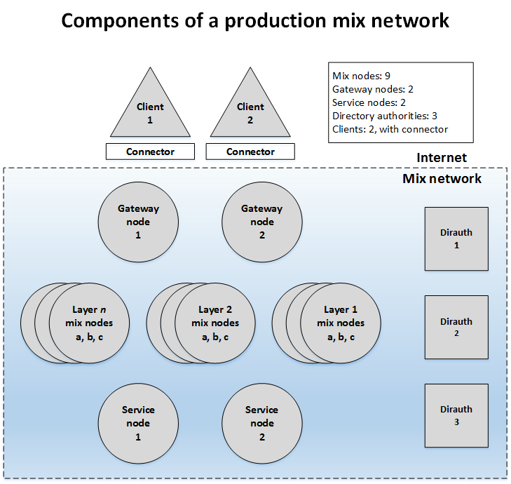

---
title:
linkTitle: "Components and configuration"
description: ""
url: "docs/admin_guide/components.html"
date: "2025-03-05T16:03:29.357286786-08:00"
draft: false
slug: ""
layout: ""
type: ""
weight: 25
author: \["David Robinson", "David Stainton"\]
---

<div class="article">

<div class="titlepage">

<div>

<div>

# <span id="components"></span>Components and configuration of the Katzenpost mixnet

</div>

</div>

------------------------------------------------------------------------

</div>

<div class="toc">

**Table of Contents**

<span class="section">[Understanding the Katzenpost components](#overview)</span>

<span class="section">[Directory authorities (dirauths)](#intro-dirauth)</span>

<span class="section">[Mix nodes](#intro-mix)</span>

<span class="section">[Gateway nodes](#intro-gateway)</span>

<span class="section">[Service nodes](#intro-service)</span>

<span class="section">[Clients](#intro-client)</span>

<span class="section">[Configuring Katzenpost](#configuration)</span>

<span class="section">[Configuring directory authorities](#auth-config)</span>

<span class="section">[Configuring mix nodes](#mix-config)</span>

<span class="section">[Configuring gateway nodes](#gateway-config)</span>

<span class="section">[Configuring service nodes](#service-config)</span>

</div>

This section of the Katzenpost technical documentation provides an introduction to
the
software components that make up Katzenpost and guidance on how to configure each
component. The intended reader is a system administrator who wants to implement a
working,
production Katzenpost network.

For a quickly deployable, non-production test network (primarily for use by developers),
<a href="https://katzenpost.network/docs/admin_guide/docker.html" class="link" target="_top">Using the Katzenpost Docker
test network</a>.

<div class="section">

<div class="titlepage">

<div>

<div>

## <span id="overview"></span>Understanding the Katzenpost components

</div>

</div>

</div>

The core of Katzenpost consists of two program executables, <a href="https://github.com/katzenpost/katzenpost/tree/main/authority" class="link" target="_top">dirauth</a> and <a href="https://github.com/katzenpost/katzenpost/tree/main/server" class="link" target="_top">server</a>. Running the <span class="command">**dirauth** </span>command runs a
<span class="emphasis">*directory authority*</span> node, or <span class="emphasis">*dirauth*</span>, that
functions as part of the mixnet's public-key infrastructure (PKI). Running the
<span class="command">**server**</span> runs either a <span class="emphasis">*mix*</span> node, a
<span class="emphasis">*gateway*</span> node, or a <span class="emphasis">*service*</span> node, depending
on the configuration. Configuration settings are provided in an associated
`katzenpost-authority.toml` or
`katzenpost.toml` file respectively.

In addition to the server components, Katzenpost also supports connections to
client applications hosted externally to the mix network and communicating with it
through gateway nodes.

A model mix network is shown in Figure 1.

<div class="figure">

<span id="d58e66"></span>

**Figure 1. The pictured element types correspond to discrete client and server programs
that
Katzenpost requires to function.**

<div class="figure-contents">

<div class="mediaobject">



</div>

</div>

</div>

  

The mix network contains an <span class="emphasis">*n*</span>-layer topology of mix-nodes, with
three nodes per layer in this example. Sphinx packets traverse the network in one
direction only. The gateway nodes allow clients to interact with the mix network.
The
service nodes provide mix network services that mix network clients can interact with.
All messages sent by clients are handed to a <span class="emphasis">*connector*</span> daemon
hosted on the client system, passed across the Internet to a gateway, and then relayed
to a service node by way of the nine mix nodes. The service node sends its reply back
across the mix-node layers to a gateway, which transmits it across the Internet to
be
received by the targeted client. The mix, gateway, and service nodes send <span class="emphasis">*mix
descriptors*</span> to the dirauths and retrieve a <span class="emphasis">*consensus
document*</span> from them, described below.

In addition to the server components, Katzenpost supports connections to client
applications hosted externally to the mix network and communicating with it through
gateway nodes and, in some cases, a client connector.

<div class="section">

<div class="titlepage">

<div>

<div>

### <span id="intro-dirauth"></span>Directory authorities (dirauths)

</div>

</div>

</div>

Dirauths compose the decentralized public key infrastructure (PKI) that serves as
the root of security for the entire mix network. Clients, mix nodes, gateways nodes,
and service nodes rely on the PKI/dirauth system to maintain and sign an up-to-date
consensus document, providing a view of the network including connection information
and public cryptographic key materials and signatures.

Every 20 minutes (the current value for an <span class="emphasis">*epoch*</span>), each mix,
gateway, and service node signs a mix descriptor and uploads it to the dirauths. The
dirauths then vote on a new consensus document. If consensus is reached, each
dirauth signs the document. Clients and nodes download the document as needed and
verify the signatures. Consensus fails when 1/2 + 1 nodes fail, which yields greater
fault tolerance than, for example, Byzantine Fault Tolerance, which fails when 1/3
+
1 of the nodes fail.

The PKI signature scheme is fully configurable by the dirauths. Our recommendation
is to use a hybrid signature scheme consisting of classical Ed25519 and the
post-quantum, stateless, hash-based signature scheme known as Sphincs+ (with the
parameters: "sphincs-shake-256f"), which is designated in Katzenpost
configurations as "Ed25519 Sphincs+". Examples are provided below.

</div>

<div class="section">

<div class="titlepage">

<div>

<div>

### <span id="intro-mix"></span>Mix nodes

</div>

</div>

</div>

The mix node is the fundamental building block of the mix network.

Katzenpost mix nodes are arranged in a layered topology to achieve the best
levels of anonymity and ease of analysis while being flexible enough to scale with
traffic demands.

</div>

<div class="section">

<div class="titlepage">

<div>

<div>

### <span id="intro-gateway"></span>Gateway nodes

</div>

</div>

</div>

Gateway nodes provide external client access to the mix network. Because gateways
are uniquely positioned to identify clients, they are designed to have as little
information about client behavior as possible. Gateways are randomly selected and
have no persistent relationship with clients and no knowledge of whether a client's
packets are decoys or not. When client traffic through a gateway is slow, the node
additionally generates decoy traffic.

</div>

<div class="section">

<div class="titlepage">

<div>

<div>

### <span id="intro-service"></span>Service nodes

</div>

</div>

</div>

Service
nodes provide functionality requested by clients. They are
logically positioned at the deepest point of the mix network, with incoming queries
and outgoing replies both needing to traverse all <span class="emphasis">*n*</span> layers of
mix nodes. A service node's functionality may involve storing messages, publishing
information outside of the mixnet, interfacing with a blockchain node, and so on.
Service nodes also process decoy packets.

</div>

<div class="section">

<div class="titlepage">

<div>

<div>

### <span id="intro-client"></span>Clients

</div>

</div>

</div>

Client applications should be designed so that the following conditions are
met:

<div class="itemizedlist">

- Separate service requests from a client are unlinkable. Repeating the same
  request may be lead to linkability.

- Service nodes and clients have no persistent relationship.

- Clients generate a stream of packets addressed to random or pseudorandom
  services regardless of whether a real service request is being made. Most of
  these packets will be decoy traffic.

- Traffic from a client to a service node must be correctly coupled with
  decoy traffic. This can mean that the service node is chosen independently
  from traffic history, or that the transmitted packet replaces a decoy packet
  that was meant to go to the desired service.

</div>

Katzenpost currently includes several client applications. All applications
make extensive use of Sphinx single-use reply blocks (SURBs), which enable service
nodes to send replies without knowing the location of the client. Newer clients
require a connection through the client <span class="emphasis">*connector*</span>, which
provides multiplexing and privilege separation with a consequent reduction in
processing overhead.

The following client applications are available.

<div class="table">

<span id="d58e139"></span>

**Table 1. Katzenpost clients**

<div class="table-contents">

<table class="table" data-border="1">
<thead>
<tr class="header">
<th><p>Name</p></th>
<th><p>Needs connector</p></th>
<th><p>Description</p></th>
<th><p>Code</p></th>
</tr>
</thead>
<tbody>
<tr class="odd">
<td><p>Ping</p></td>
<td><p>no</p></td>
<td><p>The mix network equivalent of an ICMP ping utility, used
for network testing.</p></td>
<td><p>GitHub: <a href="https://github.com/katzenpost/katzenpost/tree/main/ping" class="link" target="_top">ping</a></p></td>
</tr>
<tr class="even">
<td>Fetch</td>
<td><p>no</p></td>
<td><p>Fetches the PKI document containing peer
information.</p></td>
<td>GitHub: <a href="https://github.com/katzenpost/katzenpost/tree/main/authority/cmd/fetch" class="link" target="_top">fetch</a></td>
</tr>
<tr class="odd">
<td><p>Katzen</p></td>
<td><p>no</p></td>
<td><p>A text chat client with file-transfer support.</p></td>
<td><p>GitHub: <a href="https://github.com/katzenpost/katzen" class="link" target="_top">katzen</a></p></td>
</tr>
<tr class="even">
<td><p>Status</p></td>
<td><p>yes</p></td>
<td><p>An HTML page containing status information about the mix
network.</p></td>
<td><p>GitHub: <a href="https://github.com/katzenpost/status" class="link" target="_top">status</a></p></td>
</tr>
<tr class="odd">
<td><p>Worldmap</p></td>
<td>yes</td>
<td><p>An HTML page with a world map showing geographic locations
of mix network nodes.</p></td>
<td><p>GitHub: <a href="https://github.com/katzenpost/worldmap" class="link" target="_top">worldmap</a></p></td>
</tr>
</tbody>
</table>

</div>

</div>

  

</div>

</div>

<div class="section">

<div class="titlepage">

<div>

<div>

## <span id="configuration"></span>Configuring Katzenpost

</div>

</div>

</div>

This section documents the configuration parameters for each type of Katzenpost
server node. Each node has its own configuration file in <a href="https://toml.io/en/v1.0.0" class="link" target="_top">TOML</a> format.

<div class="section">

<div class="titlepage">

<div>

<div>

### <span id="auth-config"></span>Configuring directory authorities

</div>

</div>

</div>

The following configuration is drawn from the reference implementation in
`katzenpost/docker/dirauth_mixnet/auth1/authority.toml`. In a
real-world mixnet, the component hosts would not be sharing a single IP address. For
more information about the test mixnet, see <a href="https://katzenpost.network/docs/admin_guide/docker.html" class="link" target="_top">Using the Katzenpost
Docker test network</a>.

<div class="table">

<span id="d58e235"></span>

**Table 2. <span class="bold">**Directory authority (dirauth) configuration
sections**</span>**

<div class="table-contents">

<table class="table" data-border="1">
<tbody>
<tr class="odd">
<td><p><a href="#auth-server-section-config" class="xref" title="Dirauth: Server section">Dirauth: Server section</a></p></td>
</tr>
<tr class="even">
<td><p><a href="#auth-authorities-section-config" class="xref" title="Dirauth: Authorities section">Dirauth: <code class="code">Authorities</code>
section</a></p></td>
</tr>
<tr class="odd">
<td><p><a href="#auth-logging" class="xref" title="Dirauth: Logging section">Dirauth: Logging section</a></p></td>
</tr>
<tr class="even">
<td><p><a href="#auth-parameters" class="xref" title="Dirauth: Parameters section">Dirauth: Parameters section</a></p></td>
</tr>
<tr class="odd">
<td><p><a href="#auth-debug" class="xref" title="Dirauth: Debug section">Dirauth: Debug section</a></p></td>
</tr>
<tr class="even">
<td><p><a href="#auth-mixes-section-config" class="xref" title="Dirauth: Mixes sections">Dirauth: Mixes
sections</a></p></td>
</tr>
<tr class="odd">
<td><p><a href="#auth-gatewaynodes-section-config" class="xref" title="Dirauth: GatewayNodes section">Dirauth:
GatewayNodes section</a></p></td>
</tr>
<tr class="even">
<td><p><a href="#auth-servicenodes-section-config" class="xref" title="Dirauth: ServiceNodes sections">Dirauth:
ServiceNodes sections</a></p></td>
</tr>
<tr class="odd">
<td><p><a href="#auth-topology" class="xref" title="Dirauth: Topology section">Dirauth: Topology section</a></p></td>
</tr>
<tr class="even">
<td><p><a href="#auth-sphinx-config" class="xref" title="Dirauth: SphinxGeometry section">Dirauth: SphinxGeometry
section</a></p></td>
</tr>
</tbody>
</table>

</div>

</div>

  

<div class="section">

<div class="titlepage">

<div>

<div>

#### <span id="auth-server-section-config"></span>Dirauth: Server section

</div>

</div>

</div>

The `Server` section configures mandatory basic parameters for each
directory authority.

``` programlisting
[Server]
    Identifier = "auth1"
    WireKEMScheme = "xwing"
    PKISignatureScheme = "Ed25519 Sphincs+"
    Addresses = ["tcp://127.0.0.1:30001"]
    DataDir = "/dirauth_mixnet/auth1"
```

<div class="itemizedlist">

- <span class="bold">**Identifier**</span>

  Specifies the human-readable identifier for a node, and must be unique
  per mixnet. The identifier can be an FQDN but does not have to
  be.

  Type: string

  Required: Yes

- <span class="bold">**WireKEMScheme**</span>

  Specifies the key encapsulation mechanism (KEM) scheme
  for the <a href="https://eprint.iacr.org/2022/539" class="link" target="_top">PQ
  Noise</a>-based wire protocol (link layer) that nodes use
  to communicate with each other. PQ Noise is a post-quantum variation of
  the <a href="https://noiseprotocol.org/" class="link" target="_top">Noise protocol
  framework</a>, which algebraically transforms ECDH handshake
  patterns into KEM encapsulate/decapsulate operations.

  This configuration option supports the optional use of
  hybrid post-quantum cryptography to strengthen security. The following KEM
  schemes are supported:

  <div class="itemizedlist">

  - <span class="bold">**Classical:**</span> "x25519", "x448"

    <div class="note" style="margin-left: 0.5in; margin-right: 0.5in;">

    <table data-border="0" data-summary="Note">
    <tbody>
    <tr class="odd">
    <td rowspan="2" style="text-align: center;" data-valign="top" width="25"></td>
    <td style="text-align: left;">Note</td>
    </tr>
    <tr class="even">
    <td style="text-align: left;" data-valign="top"><p>X25519 and X448 are actually non-interactive key-exchanges
    (NIKEs), not KEMs. Katzenpost uses
    a hashed ElGamal cryptographic construction
    to convert them from NIKEs to KEMs.</p></td>
    </tr>
    </tbody>
    </table>

    </div>

  - <span class="bold">**Post-quantum:**</span>
    "mlkem768","sntrup4591761", "frodo640shake", "mceliece348864",
    "mceliece348864f", "mceliece460896", "mceliece460896f", "mceliece6688128",
    "mceliece6688128f", "mceliece6960119", "mceliece6960119f",
    "mceliece8192128", "mceliece8192128f", "CTIDH511", "CTIDH512", "CTIDH1024",
    "CTIDH2048",

  - <span class="bold">**Hybrid post-quantum:**</span>
    "xwing", "Kyber768-X25519",
    "MLKEM768-X25519", "MLKEM768-X448", "FrodoKEM-640-SHAKE-X448",
    "sntrup4591761-X448", "mceliece348864-X25519", "mceliece348864f-X25519",
    "mceliece460896-X25519", "mceliece460896f-X25519", "mceliece6688128-X25519",
    "mceliece6688128f-X25519", "mceliece6960119-X25519", "mceliece6960119f-X25519",
    "mceliece8192128-X25519", "mceliece8192128f-X25519",
    "CTIDH512-X25519", "CTIDH512-X25519"

  </div>

  Type: string

  Required: Yes

- <span class="bold">**PKISignatureScheme**</span>

  Specifies the cryptographic signature scheme which will be used by all
  components of the mix network when interacting with the PKI system. Mix
  nodes sign their descriptors using this signature scheme, and dirauth
  nodes similarly sign PKI documents using the same scheme.

  The following signature schemes are supported: "ed25519", "ed448",
  "Ed25519 Sphincs+", "Ed448-Sphincs+", "Ed25519-Dilithium2",
  "Ed448-Dilithium3"

  Type: string

  Required: Yes

- <span class="bold">**Addresses**</span>

  Specifies a list of one or more address URLs in a format that contains
  the transport protocol, IP address, and port number that the node will
  bind to for incoming connections. Katzenpost supports URLs with that
  start with either "tcp://" or "quic://" such as:
  \["tcp://192.168.1.1:30001"\] and \["quic://192.168.1.1:40001"\].

  Type: \[\]string

  Required: Yes

- <span class="bold">**DataDir**</span>

  Specifies the absolute path to a node's state directory. This is
  where` persistence.db` is written to disk and
  where a node stores its cryptographic key materials when started with
  the "-g" command-line option.

  Type: string

  Required: Yes

</div>

</div>

<div class="section">

<div class="titlepage">

<div>

<div>

#### <span id="auth-authorities-section-config"></span>Dirauth: `Authorities` section

</div>

</div>

</div>

An `Authorities` section is configured for each peer authority. We
recommend using <a href="https://quickref.me/toml.html" class="link" target="_top">TOML's style</a>
for multi-line quotations for key materials.

``` programlisting
[[Authorities]]
    Identifier = "auth1"
    IdentityPublicKey = """
-----BEGIN ED25519 PUBLIC KEY-----
dYpXpbozjFfqhR45ZC2q97SOOsXMANdHaEdXrP42CJk=
-----END ED25519 PUBLIC KEY-----
"""
    PKISignatureScheme = "Ed25519"
    LinkPublicKey = """
-----BEGIN XWING PUBLIC KEY-----
ooQBPYNdmfwnxXmvnljPA2mG5gWgurfHhbY87DMRY2tbMeZpinJ5BlSiIecprnmm
QqxcS9o36IS62SVMlOUkw+XEZGVvc9wJqHpgEgVJRAs1PCR8cUAdM6QIYLWt/lkf
SPKDCtZ3GiSIOzMuaglo2tarIPEv1AY7r9B0xXOgSKMkGyBkCfw1VBZf46MM26NL
...
gHtNyQJnXski52O03JpZRIhR40pFOhAAcMMAZDpMTVoxlcdR6WA4SlBiSceeJBgY
Yp9PlGhCimx9am99TrdLoLCdTHB6oowt8tss3POpIOxaSlguyeym/sBhkUrnXOgN
ldMtDsvvc9KUfE4I0+c+XQ==
-----END XWING PUBLIC KEY-----
    """
    WireKEMScheme = "xwing"
    Addresses = ["tcp://127.0.0.1:30001"]
```

<div class="itemizedlist">

- <span class="bold">**Identifier**</span>

  Specifies the human-readable identifier for the node which must be
  unique per mixnet. The identifier can be an FQDN but does not have to
  be.

  Type: string

  Required: Yes

- <span class="bold">**IdentityPublicKey**</span>

  String containing the node's public identity key in PEM format.
  `IdentityPublicKey` is the node's permanent identifier
  and is used to verify cryptographic signatures produced by its private
  identity key.

  Type: string

  Required: Yes

- <span class="bold">**PKISignatureScheme**</span>

  Specifies the cryptographic signature scheme used by all directory
  authority nodes. `PKISignatureScheme` must match the scheme
  specified in the `Server` section of the configuration.

  Type: string

  Required: Yes

- <span class="bold">**LinkPublicKey**</span>

  String containing the peer's public link-layer key in PEM format.
  `LinkPublicKey` must match the specified
  `WireKEMScheme`.

  Type: string

  Required: Yes

- <span class="bold">**WireKEMScheme**</span>

  Specifies the key encapsulation mechanism (KEM) scheme
  for the <a href="https://eprint.iacr.org/2022/539" class="link" target="_top">PQ
  Noise</a>-based wire protocol (link layer) that nodes use
  to communicate with each other. PQ Noise is a post-quantum variation of
  the <a href="https://noiseprotocol.org/" class="link" target="_top">Noise protocol
  framework</a>, which algebraically transforms ECDH handshake
  patterns into KEM encapsulate/decapsulate operations.

  This configuration option supports the optional use of
  hybrid post-quantum cryptography to strengthen security. The following KEM
  schemes are supported:

  <div class="itemizedlist">

  - <span class="bold">**Classical:**</span> "x25519", "x448"

    <div class="note" style="margin-left: 0.5in; margin-right: 0.5in;">

    <table data-border="0" data-summary="Note">
    <tbody>
    <tr class="odd">
    <td rowspan="2" style="text-align: center;" data-valign="top" width="25"></td>
    <td style="text-align: left;">Note</td>
    </tr>
    <tr class="even">
    <td style="text-align: left;" data-valign="top"><p>X25519 and X448 are actually non-interactive key-exchanges
    (NIKEs), not KEMs. Katzenpost uses
    a hashed ElGamal cryptographic construction
    to convert them from NIKEs to KEMs.</p></td>
    </tr>
    </tbody>
    </table>

    </div>

  - <span class="bold">**Post-quantum:**</span>
    "mlkem768","sntrup4591761", "frodo640shake", "mceliece348864",
    "mceliece348864f", "mceliece460896", "mceliece460896f", "mceliece6688128",
    "mceliece6688128f", "mceliece6960119", "mceliece6960119f",
    "mceliece8192128", "mceliece8192128f", "CTIDH511", "CTIDH512", "CTIDH1024",
    "CTIDH2048",

  - <span class="bold">**Hybrid post-quantum:**</span>
    "xwing", "Kyber768-X25519",
    "MLKEM768-X25519", "MLKEM768-X448", "FrodoKEM-640-SHAKE-X448",
    "sntrup4591761-X448", "mceliece348864-X25519", "mceliece348864f-X25519",
    "mceliece460896-X25519", "mceliece460896f-X25519", "mceliece6688128-X25519",
    "mceliece6688128f-X25519", "mceliece6960119-X25519", "mceliece6960119f-X25519",
    "mceliece8192128-X25519", "mceliece8192128f-X25519",
    "CTIDH512-X25519", "CTIDH512-X25519"

  </div>

  Type: string

  Required: Yes

- <span class="bold">**Addresses**</span>

  Specifies a list of one or more address URLs in a format that contains
  the transport protocol, IP address, and port number that the node will
  bind to for incoming connections. Katzenpost supports URLs with that
  start with either "tcp://" or "quic://" such as:
  \["tcp://192.168.1.1:30001"\] and \["quic://192.168.1.1:40001"\].

  Type: \[\]string

  Required: Yes

</div>

</div>

<div class="section">

<div class="titlepage">

<div>

<div>

#### <span id="auth-logging"></span>Dirauth: Logging section

</div>

</div>

</div>

<div class="simplesect">

<div class="titlepage">

<div>

<div>

##### <span id="d58e467"></span>

</div>

</div>

</div>

<div class="informalexample">

The `Logging` configuration section controls logging behavior across Katzenpost.

``` programlisting
[Logging]
                Disable = false
                File = "katzenpost.log"
                Level = "INFO"
```

<div class="itemizedlist">

- <span class="bold">**Disable**</span>

  If <span class="bold">**true**</span>, logging is disabled.

  Type: bool

  Required: No

- <span class="bold">**File**</span>

  Specifies the log file. If omitted, `stdout` is used.

  An absolute or relative file path can be specified. A relative path is
  relative to the DataDir specified in the `Server` section of the
  configuration.

  Type: string

  Required: No

- <span class="bold">**Level**</span>

  Supported logging level values are ERROR | WARNING | NOTICE |INFO | DEBUG.

  Type: string

  Required: No

  <div class="warning" style="margin-left: 0.5in; margin-right: 0.5in;">

  <table data-border="0" data-summary="Warning">
  <tbody>
  <tr class="odd">
  <td rowspan="2" style="text-align: center;" data-valign="top" width="25"></td>
  <td style="text-align: left;">Warning</td>
  </tr>
  <tr class="even">
  <td style="text-align: left;" data-valign="top"><p>The DEBUG log level is unsafe for
  production use.</p></td>
  </tr>
  </tbody>
  </table>

  </div>

</div>

</div>

</div>

</div>

<div class="section">

<div class="titlepage">

<div>

<div>

#### <span id="auth-parameters"></span>Dirauth: Parameters section

</div>

</div>

</div>

The `Parameters` section contains the network parameters.

``` programlisting
[Parameters]
    SendRatePerMinute = 0
    Mu = 0.005
    MuMaxDelay = 1000
    LambdaP = 0.001
    LambdaPMaxDelay = 1000
    LambdaL = 0.0005
    LambdaLMaxDelay = 1000
    LambdaD = 0.0005
    LambdaDMaxDelay = 3000
    LambdaM = 0.0005
    LambdaG = 0.0
    LambdaMMaxDelay = 100
    LambdaGMaxDelay = 100
```

<div class="itemizedlist">

- <span class="bold">**SendRatePerMinute**</span>

  Specifies the maximum allowed rate of packets per client per gateway
  node. Rate limiting is done on the gateway nodes.

  Type: uint64

  Required: Yes

- <span class="bold">**Mu**</span>

  Specifies the inverse of the mean of the exponential distribution from
  which the Sphinx packet per-hop mixing delay will be sampled.

  Type: float64

  Required: Yes

- <span class="bold">**MuMaxDelay**</span>

  Specifies the maximum Sphinx packet per-hop mixing delay in
  milliseconds.

  Type: uint64

  Required: Yes

- <span class="bold">**LambdaP**</span>

  Specifies the inverse of the mean of the exponential distribution that
  clients sample to determine the time interval between sending messages,
  whether actual messages from the FIFO egress queue or decoy messages if
  the queue is empty.

  Type: float64

  Required: Yes

- <span class="bold">**LambdaPMaxDelay**</span>

  Specifies the maximum send delay interval for LambdaP in
  milliseconds.

  Type: uint64

  Required: Yes

- <span class="bold">**LambdaL**</span>

  Specifies the inverse of the mean of the exponential distribution that
  clients sample to determine the delay interval between loop
  decoys.

  Type: float64

  Required: Yes

- <span class="bold">**LambdaLMaxDelay**</span>

  Specifies the maximum send delay interval for LambdaL in
  milliseconds.

  Type: uint64

  Required: Yes

- <span class="bold">**LambdaD**</span>

  LambdaD is the inverse of the mean of the exponential distribution
  that clients sample to determine the delay interval between decoy drop
  messages.

  Type: float64

  Required: Yes

- <span class="bold">**LambdaDMaxDelay**</span>

  Specifies the maximum send interval in for LambdaD in milliseconds.

  Type: uint64

  Required: Yes

- <span class="bold">**LambdaM**</span>

  LambdaM is the inverse of the mean of the exponential distribution
  that mix nodes sample to determine the delay between mix loop
  decoys.

  Type: float64

  Required: Yes

- <span class="bold">**LambdaG**</span>

  LambdaG is the inverse of the mean of the exponential distribution
  that gateway nodes to select the delay between gateway node
  decoys.

  <div class="warning" style="margin-left: 0.5in; margin-right: 0.5in;">

  <table data-border="0" data-summary="Warning">
  <tbody>
  <tr class="odd">
  <td rowspan="2" style="text-align: center;" data-valign="top" width="25"></td>
  <td style="text-align: left;">Warning</td>
  </tr>
  <tr class="even">
  <td style="text-align: left;" data-valign="top"><p>Do not set this value manually in the TOML configuration file. The
  field is used internally by the dirauth server state machine.</p></td>
  </tr>
  </tbody>
  </table>

  </div>

  Type: float64

  Required: Yes

- <span class="bold">**LambdaMMaxDelay**</span>

  Specifies the maximum delay for LambdaM in milliseconds.

  Type: uint64

  Required: Yes

- <span class="bold">**LambdaGMaxDelay**</span>

  Specifies the maximum delay for LambdaG in milliseconds.

  Type: uint64

  Required: Yes

</div>

</div>

<div class="section">

<div class="titlepage">

<div>

<div>

#### <span id="auth-debug"></span>Dirauth: Debug section

</div>

</div>

</div>

``` programlisting
[Debug]
    Layers = 3
    MinNodesPerLayer = 1
    GenerateOnly = false
```

<div class="itemizedlist">

- <span class="bold">**Layers**</span>

  Specifies the number of non-service-provider layers in the network
  topology.

  Type: int

  Required: Yes

- <span class="bold">**MinNodesrPerLayer**</span>

  Specifies the minimum number of nodes per layer required to form a
  valid consensus document.

  Type: int

  Required: Yes

- <span class="bold">**GenerateOnly**</span>

  If <span class="bold">**true**</span>, the server halts and cleans
  up the data directory immediately after long-term key generation.

  Type: bool

  Required: No

</div>

</div>

<div class="section">

<div class="titlepage">

<div>

<div>

#### <span id="auth-mixes-section-config"></span>Dirauth: Mixes sections

</div>

</div>

</div>

The `Mixes` configuration sections list mix nodes that are known to
the authority.

``` programlisting
[[Mixes]]
    Identifier = "mix1"
    IdentityPublicKeyPem = "../mix1/identity.public.pem"

[[Mixes]]
    Identifier = "mix2"
    IdentityPublicKeyPem = "../mix2/identity.public.pem"

[[Mixes]]
    Identifier = "mix3"
    IdentityPublicKeyPem = "../mix3/identity.public.pem"
```

<div class="itemizedlist">

- <span class="bold">**Identifier**</span>

  Specifies the human-readable identifier for a mix node, and must be
  unique per mixnet. The identifier can be an FQDN but does not have to
  be.

  Type: string

  Required: Yes

- <span class="bold">**IdentityPublicKeyPem**</span>

  Path and file name of a mix node's public identity signing key, also
  known as the identity key, in PEM format.

  Type: string

  Required: Yes

</div>

</div>

<div class="section">

<div class="titlepage">

<div>

<div>

#### <span id="auth-gatewaynodes-section-config"></span>Dirauth: GatewayNodes section

</div>

</div>

</div>

The `GatewayNodes` sections list gateway nodes that are known to
the authority.

``` programlisting
[[GatewayNodes]]
    Identifier = "gateway1"
    IdentityPublicKeyPem = "../gateway1/identity.public.pem"
```

<div class="itemizedlist">

- <span class="bold">**Identifier**</span>

  Specifies the human-readable identifier for a gateway node, and must
  be unique per mixnet. Identifier can be an FQDN but does not have to
  be.

  Type: string

  Required: Yes

- <span class="bold">**IdentityPublicKeyPem**</span>

  Path and file name of a gateway node's public identity signing key,
  also known as the identity key, in PEM format.

  Type: string

  Required: Yes

</div>

</div>

<div class="section">

<div class="titlepage">

<div>

<div>

#### <span id="auth-servicenodes-section-config"></span>Dirauth: ServiceNodes sections

</div>

</div>

</div>

The `ServiceNodes` sections list service nodes that are known to
the authority.

``` programlisting
[[ServiceNodes]]
    Identifier = "servicenode1"
    IdentityPublicKeyPem = "../servicenode1/identity.public.pem"
```

<div class="itemizedlist">

- <span class="bold">**Identifier**</span>

  Specifies the human-readable identifier for a service node, and must
  be unique per mixnet. Identifier can be an FQDN but does not have to
  be.

  Type: string

  Required: Yes

- <span class="bold">**IdentityPublicKeyPem**</span>

  Path and file name of a service node's public identity signing key,
  also known as the identity key, in PEM format.

  Type: string

  Required: Yes

</div>

</div>

<div class="section">

<div class="titlepage">

<div>

<div>

#### <span id="auth-topology"></span>Dirauth: Topology section

</div>

</div>

</div>

The `Topology` section defines the layers of the mix network and
the mix nodes in each layer.

``` programlisting
[Topology]
                    
    [[Topology.Layers]]
    
        [[Topology.Layers.Nodes]]
            Identifier = "mix1"
            IdentityPublicKeyPem = "../mix1/identity.public.pem"
    
    [[Topology.Layers]]
    
        [[Topology.Layers.Nodes]]
            Identifier = "mix2"
            IdentityPublicKeyPem = "../mix2/identity.public.pem"
    
    [[Topology.Layers]]
    
        [[Topology.Layers.Nodes]]
            Identifier = "mix3"
            IdentityPublicKeyPem = "../mix3/identity.public.pem"
```

<div class="itemizedlist">

- <span class="bold">**Identifier**</span>

  Specifies the human-readable identifier for a node, and must be unique
  per mixnet. The identifier can be an FQDN but does not have to
  be.

  Type: string

- <span class="bold">**IdentityPublicKeyPem**</span>

  Path and file name of a mix node's public identity signing key, also
  known as the identity key, in PEM format.

  Type: string

  Required: Yes

</div>

</div>

<div class="section">

<div class="titlepage">

<div>

<div>

#### <span id="auth-sphinx-config"></span>Dirauth: SphinxGeometry section

</div>

</div>

</div>

Sphinx is an encrypted nested-packet format designed primarily for mixnets.
The <a href="https://www.freehaven.net/anonbib/cache/DBLP:conf/sp/DanezisG09.pdf" class="link" target="_top">original Sphinx paper</a> described a non-interactive key exchange
(NIKE) employing classical encryption. The Katzenpost implementation
strongly emphasizes configurability, supporting key encapsulation mechanisms
(KEMs) as well as NIKEs, and enabling the use of either classical or hybrid
post-quantum cryptography. Hybrid constructions offset the newness of
post-quantum algorithms by offering heavily tested classical algorithms as a
fallback.

<div class="note" style="margin-left: 0.5in; margin-right: 0.5in;">

<table data-border="0" data-summary="Note">
<tbody>
<tr class="odd">
<td rowspan="2" style="text-align: center;" data-valign="top" width="25"></td>
<td style="text-align: left;">Note</td>
</tr>
<tr class="even">
<td style="text-align: left;" data-valign="top"><p>Sphinx, the nested-packet format, should not be confused with <a href="http://sphincs.org/index.html" class="link" target="_top">Sphincs or Sphincs+</a>, which
are post-quantum signature schemes.</p></td>
</tr>
</tbody>
</table>

</div>

Katzenpost Sphinx also relies on the following classical cryptographic
primitives:

<div class="itemizedlist">

- CTR-AES256, a stream cipher

- HMAC-SHA256, a message authentication code (MAC) function

- HKDF-SHA256, a key derivation function (KDF)

- AEZv5, a strong pseudorandom permutation (SPRP)

</div>

All dirauths must be configured to use the same `SphinxGeometry`
parameters. Any geometry not advertised by the PKI document will fail. Each
dirauth publishes the hash of its `SphinxGeometry` parameters in the
PKI document for validation by its peer dirauths.

<div class="simplesect">

<div class="titlepage">

<div>

<div>

##### <span id="d58e774"></span>

</div>

</div>

</div>

<div class="informalexample">

The `SphinxGeometry` section defines parameters for the Sphinx
encrypted nested-packet format used internally by Katzenpost.

The settings in this section are generated by the <a href="https://github.com/katzenpost/katzenpost/tree/main/gensphinx" class="link" target="_top">gensphinx</a> utility, which computes the Sphinx geometry based on the
following user-supplied directives:

<div class="itemizedlist">

- The number of mix node layers (not counting gateway and service
  nodes)

- The length of the application-usable packet payload

- The selected NIKE or KEM scheme

</div>

<div class="warning" style="margin-left: 0.5in; margin-right: 0.5in;">

<table data-border="0" data-summary="Warning">
<tbody>
<tr class="odd">
<td rowspan="2" style="text-align: center;" data-valign="top" width="25"></td>
<td style="text-align: left;">Warning</td>
</tr>
<tr class="even">
<td style="text-align: left;" data-valign="top"><p>The values in the <code class="code">SphinxGeometry</code> configuration section must
be programmatically generated by <span class="command"><strong>gensphinx</strong></span>. Many of the
parameters are interdependent and cannot be individually modified. Do not
modify the these values by hand.</p></td>
</tr>
</tbody>
</table>

</div>

</div>

<div class="informalexample">

The <span class="command">**gensphinx**</span> output in TOML should then be pasted unchanged
into the node's configuration file, as shown below.

``` programlisting
[SphinxGeometry]
                PacketLength = 3082
                NrHops = 5
                HeaderLength = 476
                RoutingInfoLength = 410
                PerHopRoutingInfoLength = 82
                SURBLength = 572
                SphinxPlaintextHeaderLength = 2
                PayloadTagLength = 32
                ForwardPayloadLength = 2574
                UserForwardPayloadLength = 2000
                NextNodeHopLength = 65
                SPRPKeyMaterialLength = 64
                NIKEName = "x25519"
                KEMName = ""
```

<div class="itemizedlist">

- <span class="bold">**PacketLength**</span>

  The length of a Sphinx packet in bytes.

  Type: int

  Required: Yes

- <span class="bold">**NrHops**</span>

  The number of hops a Sphinx packet takes through the mixnet. Because
  packet headers hold destination information for each hop, the size of the
  header increases linearly with the number of hops.

  Type: int

  Required: Yes

- <span class="bold">**HeaderLength**</span>

  The total length of the Sphinx packet header in bytes.

  Type: int

  Required: Yes

- <span class="bold">**RoutingInfoLength**</span>

  The total length of the routing information portion of the Sphinx packet
  header.

  Type: int

  Required: Yes

- <span class="bold">**PerHopRoutingInfoLength**</span>

  The length of the per-hop routing information in the Sphinx packet
  header.

  Type: int

  Required: Yes

- <span class="bold">**SURBLength**</span>

  The length of a single-use reply block (SURB).

  Type: int

  Required: Yes

- <span class="bold">**SphinxPlaintextHeaderLength**</span>

  The length of the plaintext Sphinx packet header.

  Type: int

  Required: Yes

- <span class="bold">**PayloadTagLength**</span>

  The length of the payload tag.

  Type: int

  Required: Yes

- <span class="bold">**ForwardPayloadLength**</span>

  The total size of the payload.

  Type: int

  Required: Yes

- <span class="bold">**UserForwardPayloadLength**</span>

  The size of the usable payload.

  Type: int

  Required: Yes

- <span class="bold">**NextNodeHopLength**</span>

  The `NextNodeHopLength` is derived from the largest
  routing-information block that we expect to encounter. Other packets have
  `NextNodeHop` + `NodeDelay` sections, or a
  `Recipient` section, both of which are shorter.

  Type: int

  Required: Yes

- <span class="bold">**SPRPKeyMaterialLength**</span>

  The length of the strong pseudo-random permutation (SPRP) key.

  Type: int

  Required: Yes

- <span class="bold">**NIKEName**</span>

  The name of the non-interactive key exchange (NIKE) scheme used by Sphinx
  packets.

  `NIKEName` and `KEMName` are mutually
  exclusive.

  Type: string

  Required: Yes

- <span class="bold">**KEMName**</span>

  The name of the key encapsulation mechanism (KEM) used by Sphinx
  packets.

  `NIKEName` and `KEMName` are mutually
  exclusive.

  Type: string

  Required: Yes

</div>

</div>

</div>

</div>

</div>

<div class="section">

<div class="titlepage">

<div>

<div>

### <span id="mix-config"></span>Configuring mix nodes

</div>

</div>

</div>

The following configuration is drawn from the reference implementation in
`katzenpost/docker/dirauth_mixnet/mix1/katzenpost.toml`. In a
real-world mixnet, the component hosts would not be sharing a single IP address. For
more information about the test mixnet, see <a href="https://katzenpost.network/docs/admin_guide/docker.html" class="link" target="_top">Using the Katzenpost Docker test network</a>.

<div class="table">

<span id="d58e939"></span>

**Table 3. Mix node configuration sections**

<div class="table-contents">

<table class="table" data-border="1">
<tbody>
<tr class="odd">
<td><p><a href="#mix-server-section-config" class="xref" title="Mix node: Server section">Mix node: Server section</a></p></td>
</tr>
<tr class="even">
<td><p><a href="#mix-logging-config" class="xref" title="Mix node: Logging section">Mix node: Logging section</a></p></td>
</tr>
<tr class="odd">
<td><p><a href="#mix-pki-config" class="xref" title="Mix node: PKI section">Mix node: PKI section</a></p></td>
</tr>
<tr class="even">
<td><p><a href="#mix-management-config" class="xref" title="Mix node: Management section">Mix node: Management section</a></p></td>
</tr>
<tr class="odd">
<td><p><a href="#mix-sphinx-config" class="xref" title="Mix node: SphinxGeometry section">Mix node: SphinxGeometry section</a></p></td>
</tr>
<tr class="even">
<td><p><a href="#mix-debug-config" class="xref" title="Mix node: Debug section">Mix node: Debug section</a></p></td>
</tr>
</tbody>
</table>

</div>

</div>

  

<div class="section">

<div class="titlepage">

<div>

<div>

#### <span id="mix-server-section-config"></span>Mix node: Server section

</div>

</div>

</div>

The `Server` section configures mandatory basic parameters for each
server node.

``` programlisting
[Server]
  Identifier = "mix1"
  WireKEM = "xwing"
  PKISignatureScheme = "Ed25519"
  Addresses = ["127.0.0.1:30008"]
  OnlyAdvertiseAltAddresses = false
  MetricsAddress = "127.0.0.1:30009"
  DataDir = "/dirauth_mixnet/mix1"
  IsGatewayNode = false
  IsServiceNode = false
  [Server.AltAddresses]
```

<div class="simplesect">

<div class="titlepage">

<div>

<div>

##### <span id="d58e981"></span>

</div>

</div>

</div>

<div class="informalexample">

<div class="itemizedlist">

- <span class="bold">**Identifier**</span>

  Specifies the human-readable identifier for a node, and must be unique per mixnet.
  The identifier can be an FQDN but does not have to be.

  Type: string

  Required: Yes

- <span class="bold">**WireKEM**</span>

  WireKEM specifies the key encapsulation mechanism (KEM) scheme
  for the <a href="https://eprint.iacr.org/2022/539" class="link" target="_top">PQ
  Noise</a>-based wire protocol (link layer) that nodes use
  to communicate with each other. PQ Noise is a post-quantum variation of
  the <a href="https://noiseprotocol.org/" class="link" target="_top">Noise protocol
  framework</a>, which algebraically transforms ECDH handshake
  patterns into KEM encapsulate/decapsulate operations.

  This configuration option supports the optional use of
  hybrid post-quantum cryptography to strengthen security. The following KEM
  schemes are supported:

  <div class="itemizedlist">

  - <span class="bold">**Classical:**</span> "x25519", "x448"

    <div class="note" style="margin-left: 0.5in; margin-right: 0.5in;">

    <table data-border="0" data-summary="Note">
    <tbody>
    <tr class="odd">
    <td rowspan="2" style="text-align: center;" data-valign="top" width="25"></td>
    <td style="text-align: left;">Note</td>
    </tr>
    <tr class="even">
    <td style="text-align: left;" data-valign="top"><p>X25519 and X448 are actually non-interactive key-exchanges
    (NIKEs), not KEMs. Katzenpost uses
    a hashed ElGamal cryptographic construction
    to convert them from NIKEs to KEMs.</p></td>
    </tr>
    </tbody>
    </table>

    </div>

  - <span class="bold">**Post-quantum:**</span>
    "mlkem768","sntrup4591761", "frodo640shake", "mceliece348864",
    "mceliece348864f", "mceliece460896", "mceliece460896f", "mceliece6688128",
    "mceliece6688128f", "mceliece6960119", "mceliece6960119f",
    "mceliece8192128", "mceliece8192128f", "CTIDH511", "CTIDH512", "CTIDH1024",
    "CTIDH2048",

  - <span class="bold">**Hybrid post-quantum:**</span>
    "xwing", "Kyber768-X25519",
    "MLKEM768-X25519", "MLKEM768-X448", "FrodoKEM-640-SHAKE-X448",
    "sntrup4591761-X448", "mceliece348864-X25519", "mceliece348864f-X25519",
    "mceliece460896-X25519", "mceliece460896f-X25519", "mceliece6688128-X25519",
    "mceliece6688128f-X25519", "mceliece6960119-X25519", "mceliece6960119f-X25519",
    "mceliece8192128-X25519", "mceliece8192128f-X25519",
    "CTIDH512-X25519", "CTIDH512-X25519"

  </div>

  Type: string

  Required: Yes

- <span class="bold">**PKISignatureScheme**</span>

  Specifies the cryptographic signature scheme that will be used by all
  components of the mix network when interacting with the PKI system. Mix
  nodes sign their descriptors using this signature scheme, and dirauth nodes
  similarly sign PKI documents using the same scheme.

  The following signature schemes are supported:

  <div class="itemizedlist">

  - <span class="bold">**Classical:**</span> "ed25519", "ed448"

  - <span class="bold">**Hybrid post-quantum:**</span> "Ed25519
    Sphincs+", "Ed448-Sphincs+", "Ed25519-Dilithium2",
    "Ed448-Dilithium3"

  </div>

  Type: string

  Required: Yes

- <span class="bold">**Addresses**</span>

  Specifies a list of one or more address URLs in a format that contains the
  transport protocol, IP address, and port number that the server will bind to
  for incoming connections. Katzenpost supports URLs with that start with
  either "tcp://" or "quic://" such as: \["tcp://192.168.1.1:30001"\] and
  \["quic://192.168.1.1:40001"\].

  <span class="bold">**Addresses**</span> is overridden if <span class="bold">**BindAddresses**</span> is <span class="bold">**true**</span>. In that scenario, one or more advertised, external
  addresses is provided as the value of <span class="bold">**Addresses**</span>, and is advertised in the PKI document.

  Note that <span class="bold">**BindAddresses**</span>, below, holds the
  address values for non-advertised, internal-only listeners. The addition of
  <span class="bold">**BindAddresses**</span> to the node configuration
  is required for hosts connecting to the Internet through network address
  translation (NAT).

  Type: \[\]string

  Required: Yes

- <span class="bold">**BindAddresses**</span>

  If <span class="bold">**true**</span>, allows setting of listener
  addresses that the server will bind to and accept connections on. These
  addresses are not advertised in the PKI document. For more information, see
  <span class="bold">**Addresses**</span>, above.

  Type: bool, \[\]string

  Required: No

- <span class="bold">**MetricsAddress**</span>

  Specifies the address/port to bind the Prometheus metrics endpoint
  to.

  Type: string

  Required: No

- <span class="bold">**DataDir**</span>

  Specifies the absolute path to a node's state directory. This is where
  persistence.db is written to disk and where a node stores its cryptographic
  key materials when started with the "-g" command-line option.

  Type: string

  Required: Yes

- <span class="bold">**IsGatewayNode**</span>

  If <span class="bold">**true**</span>, the server is a gateway
  node.

  Type: bool

  Required: No

- <span class="bold">**IsServiceNode**</span>

  If <span class="bold">**true**</span>, the server is a service
  node.

  Type: bool

  Required: No

</div>

</div>

</div>

</div>

<div class="section">

<div class="titlepage">

<div>

<div>

#### <span id="mix-logging-config"></span>Mix node: Logging section

</div>

</div>

</div>

<div class="simplesect">

<div class="titlepage">

<div>

<div>

##### <span id="d58e1131"></span>

</div>

</div>

</div>

<div class="informalexample">

The `Logging` configuration section controls logging behavior across Katzenpost.

``` programlisting
[Logging]
                Disable = false
                File = "katzenpost.log"
                Level = "INFO"
```

<div class="itemizedlist">

- <span class="bold">**Disable**</span>

  If <span class="bold">**true**</span>, logging is disabled.

  Type: bool

  Required: No

- <span class="bold">**File**</span>

  Specifies the log file. If omitted, `stdout` is used.

  An absolute or relative file path can be specified. A relative path is
  relative to the DataDir specified in the `Server` section of the
  configuration.

  Type: string

  Required: No

- <span class="bold">**Level**</span>

  Supported logging level values are ERROR | WARNING | NOTICE |INFO | DEBUG.

  Type: string

  Required: No

  <div class="warning" style="margin-left: 0.5in; margin-right: 0.5in;">

  <table data-border="0" data-summary="Warning">
  <tbody>
  <tr class="odd">
  <td rowspan="2" style="text-align: center;" data-valign="top" width="25"></td>
  <td style="text-align: left;">Warning</td>
  </tr>
  <tr class="even">
  <td style="text-align: left;" data-valign="top"><p>The DEBUG log level is unsafe for
  production use.</p></td>
  </tr>
  </tbody>
  </table>

  </div>

</div>

</div>

</div>

</div>

<div class="section">

<div class="titlepage">

<div>

<div>

#### <span id="mix-pki-config"></span>Mix node: PKI section

</div>

</div>

</div>

<div class="simplesect">

<div class="titlepage">

<div>

<div>

##### <span id="d58e1180"></span>

</div>

</div>

</div>

<div class="informalexample">

The `PKI` section contains the directory authority configuration for a mix, gateway, or service
node.

``` programlisting
[PKI]
[PKI.dirauth]

    [[PKI.dirauth.Authorities]]
        Identifier = "auth1"
        IdentityPublicKey = """-----BEGIN ED25519 PUBLIC KEY-----
tqN6tpOVotHWXKCszVn2kS7vAZjQpvJjQF3Qz/Qwhyg=
-----END ED25519 PUBLIC KEY-----
"""
        PKISignatureScheme = "Ed25519"
        LinkPublicKey = """-----BEGIN XWING PUBLIC KEY-----
JnJ8ztQEIjAkKJcpuZvJAdkWjBim/5G5d8yoosEQHeGJeeBqNPdm2AitUbpiQPcd
tNCo9DxuC9Ieqmsfw0YpV6AtOOsaInA6QnHDYcuBfZcQL5MU4+t2TzpBZQYlrSED
hPCKrAG+8GEUl6akseG371WQzEtPpEWWCJCJOiS/VDFZT7eKrldlumN6gfiB84sR
...
arFh/WKwYJUj+aGBsFYSqGdzC6MdY4x/YyFe2ze0MJEjThQE91y1d/LCQ3Sb7Ri+
u6PBi3JU2qzlPEejDKwK0t5tMNEAkq8iNrpRTdD/hS0gR+ZIN8Z9QKh7Xf94FWG2
H+r8OaqImQhgHabrWRDyLg==
-----END XWING PUBLIC KEY-----
"""
        WireKEMScheme = "xwing"
        Addresses = ["127.0.0.1:30001"]

    [[PKI.dirauth.Authorities]]
        Identifier = "auth2"
        IdentityPublicKey = """-----BEGIN ED25519 PUBLIC KEY-----
O51Ty2WLu4C1ETMa29s03bMXV72gnjJfTfwLV++LVBI=
-----END ED25519 PUBLIC KEY-----    
"""
        PKISignatureScheme = "Ed25519"
        LinkPublicKey = """-----BEGIN XWING PUBLIC KEY-----
TtQkg2XKUnY602FFBaPJ+zpN0Twy20cwyyFxh7FNUjaXA9MAJXs0vUwFbJc6BjYv
f+olKnlIKFSmDvcF74U6w1F0ObugwTNKNxeYKPKhX4FiencUbRwkHoYHdtZdSctz
TKy08qKQyCAccqCRpdo6ZtYXPAU+2rthjYTOL7Zn+7SHUKCuJClcPnvEYjVcJxtZ
...
ubJIe5U4nMJbBkOqr7Kq6niaEkiLODa0tkpB8tKMYTMBdcYyHSXCzpo7U9sb6LAR
HktiTBDtRXviu2vbw7VRXhkMW2kjYZDtReQ5sAse04DvmD49zgTp1YxYW+wWFaL3
37X7/SNuLdHX4PHZXIWHBQ==
-----END XWING PUBLIC KEY-----  
"""
        WireKEMScheme = "xwing"
        Addresses = ["127.0.0.1:30002"]

    [[PKI.dirauth.Authorities]]
        Identifier = "auth3"
        IdentityPublicKey = """-----BEGIN ED25519 PUBLIC KEY-----
zQvydRYJq3npeLcg1NqIf+SswEKE5wFmiwNsI9Z1whQ=
-----END ED25519 PUBLIC KEY-----
"""
        PKISignatureScheme = "Ed25519"
        LinkPublicKey = """
-----BEGIN XWING PUBLIC KEY-----
OYK9FiC53xwZ1VST3jDOO4tR+cUMSVRSekmigZMChSjDCPZbKut8TblxtlUfc/yi
Ugorz4NIvYPMWUt3QPwS2UWq8/HMWXNGPUiAevg12+oV+jOJXaJeCfY24UekJnSw
TNcdGaFZFSR0FocFcPBBnrK1M2B8w8eEUKQIsXRDM3x/8aRIuDif+ve8rSwpgKeh
...
OdVD3yw7OOS8uPZLORGQFyJbHtVmFPVvwja4G/o2gntAoHUZ2LiJJakpVhhlSyrI
yuzvwwFtZVfWtNb5gAKZCyg0aduR3qgd7MPerRF+YopZk3OCRpC02YxfUZrHv398
FZWJFK0R8iU52CEUxVpXTA==
-----END XWING PUBLIC KEY-----  
"""
        WireKEMScheme = "xwing"
        Addresses = ["127.0.0.1:30003"]
```

<div class="itemizedlist">

- <span class="bold">**Identifier**</span>

  Specifies the human-readable identifier for a node, which must be unique per mixnet.
  The identifier can be an FQDN but does not have to be.

  Type: string

  Required: Yes

- <span class="bold">**IdentityPublicKey**</span>

  String containing the node's public identity key in PEM format.
  `IdentityPublicKey` is the node's permanent identifier
  and is used to verify cryptographic signatures produced by its private
  identity key.

  Type: string

  Required: Yes

- <span class="bold">**PKISignatureScheme**</span>

  Specifies the cryptographic signature scheme that will be used by all
  components of the mix network when interacting with the PKI system. Mix
  nodes sign their descriptors using this signature scheme, and dirauth nodes
  similarly sign PKI documents using the same scheme.

  Type: string

  Required: Yes

- <span class="bold">**LinkPublicKey**</span>

  String containing the peer's public link-layer key in PEM format.
  `LinkPublicKey` must match the specified
  `WireKEMScheme`.

  Type: string

  Required: Yes

- <span class="bold">**WireKEMScheme**</span>

  The name of the wire protocol key-encapsulation mechanism (KEM) to use.

  Type: string

  Required: Yes

- <span class="bold">**Addresses**</span>

  Specifies a list of one or more address URLs in a format that contains the
  transport protocol, IP address, and port number that the server will bind to
  for incoming connections. Katzenpost supports URLs that start with
  either "tcp://" or "quic://" such as: \["tcp://192.168.1.1:30001"\] and
  \["quic://192.168.1.1:40001"\]. The value of <span class="bold">**Addresses**</span> is advertised in the PKI document.

  Type: \[\]string

  Required: Yes

</div>

</div>

</div>

</div>

<div class="section">

<div class="titlepage">

<div>

<div>

#### <span id="mix-management-config"></span>Mix node: Management section

</div>

</div>

</div>

<div class="simplesect">

<div class="titlepage">

<div>

<div>

##### <span id="d58e1249"></span>

</div>

</div>

</div>

<div class="informalexample">

The `Management` section specifies connectivity information for the
Katzenpost control protocol which can be used to make run-time configuration
changes. A configuration resembles the following, substituting the node's configured
`DataDir` value as part of the `Path` value:

``` programlisting
[Management]
   Enable = false
   Path = "/node_datadir/management_sock"
```

<div class="itemizedlist">

- <span class="bold">**Enable**</span>

  If <span class="bold">**true**</span>, the management interface is
  enabled.

  Type: bool

  Required: No

- <span class="bold">**Path**</span>

  Specifies the path to the management interface socket. If left empty, then `management_sock`
  is located in the configuration's defined `DataDir`.

  Type: string

  Required: No

</div>

</div>

</div>

</div>

<div class="section">

<div class="titlepage">

<div>

<div>

#### <span id="mix-sphinx-config"></span>Mix node: SphinxGeometry section

</div>

</div>

</div>

<div class="simplesect">

<div class="titlepage">

<div>

<div>

##### <span id="d58e1294"></span>

</div>

</div>

</div>

<div class="informalexample">

The `SphinxGeometry` section defines parameters for the Sphinx
encrypted nested-packet format used internally by Katzenpost.

The settings in this section are generated by the <a href="https://github.com/katzenpost/katzenpost/tree/main/gensphinx" class="link" target="_top">gensphinx</a> utility, which computes the Sphinx geometry based on the
following user-supplied directives:

<div class="itemizedlist">

- The number of mix node layers (not counting gateway and service
  nodes)

- The length of the application-usable packet payload

- The selected NIKE or KEM scheme

</div>

<div class="warning" style="margin-left: 0.5in; margin-right: 0.5in;">

<table data-border="0" data-summary="Warning">
<tbody>
<tr class="odd">
<td rowspan="2" style="text-align: center;" data-valign="top" width="25"></td>
<td style="text-align: left;">Warning</td>
</tr>
<tr class="even">
<td style="text-align: left;" data-valign="top"><p>The values in the <code class="code">SphinxGeometry</code> configuration section must
be programmatically generated by <span class="command"><strong>gensphinx</strong></span>. Many of the
parameters are interdependent and cannot be individually modified. Do not
modify the these values by hand.</p></td>
</tr>
</tbody>
</table>

</div>

</div>

<div class="informalexample">

The <span class="command">**gensphinx**</span> output in TOML should then be pasted unchanged
into the node's configuration file, as shown below.

``` programlisting
[SphinxGeometry]
                PacketLength = 3082
                NrHops = 5
                HeaderLength = 476
                RoutingInfoLength = 410
                PerHopRoutingInfoLength = 82
                SURBLength = 572
                SphinxPlaintextHeaderLength = 2
                PayloadTagLength = 32
                ForwardPayloadLength = 2574
                UserForwardPayloadLength = 2000
                NextNodeHopLength = 65
                SPRPKeyMaterialLength = 64
                NIKEName = "x25519"
                KEMName = ""
```

<div class="itemizedlist">

- <span class="bold">**PacketLength**</span>

  The length of a Sphinx packet in bytes.

  Type: int

  Required: Yes

- <span class="bold">**NrHops**</span>

  The number of hops a Sphinx packet takes through the mixnet. Because
  packet headers hold destination information for each hop, the size of the
  header increases linearly with the number of hops.

  Type: int

  Required: Yes

- <span class="bold">**HeaderLength**</span>

  The total length of the Sphinx packet header in bytes.

  Type: int

  Required: Yes

- <span class="bold">**RoutingInfoLength**</span>

  The total length of the routing information portion of the Sphinx packet
  header.

  Type: int

  Required: Yes

- <span class="bold">**PerHopRoutingInfoLength**</span>

  The length of the per-hop routing information in the Sphinx packet
  header.

  Type: int

  Required: Yes

- <span class="bold">**SURBLength**</span>

  The length of a single-use reply block (SURB).

  Type: int

  Required: Yes

- <span class="bold">**SphinxPlaintextHeaderLength**</span>

  The length of the plaintext Sphinx packet header.

  Type: int

  Required: Yes

- <span class="bold">**PayloadTagLength**</span>

  The length of the payload tag.

  Type: int

  Required: Yes

- <span class="bold">**ForwardPayloadLength**</span>

  The total size of the payload.

  Type: int

  Required: Yes

- <span class="bold">**UserForwardPayloadLength**</span>

  The size of the usable payload.

  Type: int

  Required: Yes

- <span class="bold">**NextNodeHopLength**</span>

  The `NextNodeHopLength` is derived from the largest
  routing-information block that we expect to encounter. Other packets have
  `NextNodeHop` + `NodeDelay` sections, or a
  `Recipient` section, both of which are shorter.

  Type: int

  Required: Yes

- <span class="bold">**SPRPKeyMaterialLength**</span>

  The length of the strong pseudo-random permutation (SPRP) key.

  Type: int

  Required: Yes

- <span class="bold">**NIKEName**</span>

  The name of the non-interactive key exchange (NIKE) scheme used by Sphinx
  packets.

  `NIKEName` and `KEMName` are mutually
  exclusive.

  Type: string

  Required: Yes

- <span class="bold">**KEMName**</span>

  The name of the key encapsulation mechanism (KEM) used by Sphinx
  packets.

  `NIKEName` and `KEMName` are mutually
  exclusive.

  Type: string

  Required: Yes

</div>

</div>

</div>

</div>

<div class="section">

<div class="titlepage">

<div>

<div>

#### <span id="mix-debug-config"></span>Mix node: Debug section

</div>

</div>

</div>

<div class="simplesect">

<div class="titlepage">

<div>

<div>

##### <span id="d58e1452"></span>

</div>

</div>

</div>

<div class="informalexample">

The `Debug` section is the Katzenpost server debug configuration
for advanced tuning.

``` programlisting
[Debug]
                NumSphinxWorkers = 16
                NumServiceWorkers = 3
                NumGatewayWorkers = 3
                NumKaetzchenWorkers = 3
                SchedulerExternalMemoryQueue = false
                SchedulerQueueSize = 0
                SchedulerMaxBurst = 16
                UnwrapDelay = 250
                GatewayDelay = 500
                ServiceDelay = 500
                KaetzchenDelay = 750
                SchedulerSlack = 150
                SendSlack = 50
                DecoySlack = 15000
                ConnectTimeout = 60000
                HandshakeTimeout = 30000
                ReauthInterval = 30000
                SendDecoyTraffic = false
                DisableRateLimit = false
                GenerateOnly = false
```

<div class="itemizedlist">

- <span class="bold">**NumSphinxWorkers**</span>

  Specifies the number of worker instances to use for inbound Sphinx
  packet processing.

  Type: int

  Required: No

- <span class="bold">**NumProviderWorkers**</span>

  Specifies the number of worker instances to use for provider specific
  packet processing.

  Type: int

  Required: No

- <span class="bold">**NumKaetzchenWorkers**</span>

  Specifies the number of worker instances to use for Kaetzchen-specific
  packet processing.

  Type: int

  Required: No

- <span class="bold">**SchedulerExternalMemoryQueue**</span>

  If <span class="bold">**true**</span>, the experimental disk-backed external memory
  queue is enabled.

  Type: bool

  Required: No

- <span class="bold">**SchedulerQueueSize**</span>

  Specifies the maximum scheduler queue size before random entries will
  start getting dropped. A value less than or equal to zero is treated as
  unlimited.

  Type: int

  Required: No

- <span class="bold">**SchedulerMaxBurst**</span>

  Specifies the maximum number of packets that will be dispatched per
  scheduler wakeup event.

  Type:

  Required: No

- <span class="bold">**UnwrapDelay**</span>

  Specifies the maximum unwrap delay due to queueing in
  milliseconds.

  Type: int

  Required: No

- <span class="bold">**GatewayDelay**</span>

  Specifies the maximum gateway node worker delay due to queueing in milliseconds.

  Type: int

  Required: No

- <span class="bold">**ServiceDelay**</span>

  Specifies the maximum provider delay due to queueing in
  milliseconds.

  Type: int

  Required: No

- <span class="bold">**KaetzchenDelay**</span>

  Specifies the maximum kaetzchen delay due to queueing in
  milliseconds.

  Type: int

  Required: No

- <span class="bold">**SchedulerSlack**</span>

  Specifies the maximum scheduler slack due to queueing and/or
  processing in milliseconds.

  Type: int

  Required: No

- <span class="bold">**SendSlack**</span>

  Specifies the maximum send-queue slack due to queueing and/or
  congestion in milliseconds.

  Type: int

  Required: No

- <span class="bold">**DecoySlack**</span>

  Specifies the maximum decoy sweep slack due to external
  delays such as latency before a loop decoy packet will be considered
  lost.

  Type: int

  Required: No

- <span class="bold">**ConnectTimeout**</span>

  Specifies the maximum time a connection can take to establish a
  TCP/IP connection in milliseconds.

  Type: int

  Required: No

- <span class="bold">**HandshakeTimeout**</span>

  Specifies the maximum time a connection can take for a link-protocol
  handshake in milliseconds.

  Type: int

  Required: No

- <span class="bold">**ReauthInterval**</span>

  Specifies the interval at which a connection will be reauthenticated
  in milliseconds.

  Type: int

  Required: No

- <span class="bold">**SendDecoyTraffic**</span>

  If <span class="bold">**true**</span>, decoy traffic is enabled.
  This parameter is experimental and untuned,
  and is disabled by default.

  <div class="note" style="margin-left: 0.5in; margin-right: 0.5in;">

  <table data-border="0" data-summary="Note">
  <tbody>
  <tr class="odd">
  <td rowspan="2" style="text-align: center;" data-valign="top" width="25"></td>
  <td style="text-align: left;">Note</td>
  </tr>
  <tr class="even">
  <td style="text-align: left;" data-valign="top"><p>This option will be removed once decoy traffic is fully implemented.</p></td>
  </tr>
  </tbody>
  </table>

  </div>

  Type: bool

  Required: No

- <span class="bold">**DisableRateLimit**</span>

  If <span class="bold">**true**</span>, the per-client rate limiter is disabled.

  <div class="note" style="margin-left: 0.5in; margin-right: 0.5in;">

  <table data-border="0" data-summary="Note">
  <tbody>
  <tr class="odd">
  <td rowspan="2" style="text-align: center;" data-valign="top" width="25"></td>
  <td style="text-align: left;">Note</td>
  </tr>
  <tr class="even">
  <td style="text-align: left;" data-valign="top"><p>This option should only be used for testing.</p></td>
  </tr>
  </tbody>
  </table>

  </div>

  Type: bool

  Required: No

- <span class="bold">**GenerateOnly**</span>

  If <span class="bold">**true**</span>, the server immediately halts
  and cleans up after long-term key generation.

  Type: bool

  Required: No

</div>

</div>

</div>

</div>

</div>

<div class="section">

<div class="titlepage">

<div>

<div>

### <span id="gateway-config"></span>Configuring gateway nodes

</div>

</div>

</div>

The following configuration is drawn from the reference implementation in
`katzenpost/docker/dirauth_mixnet/gateway1/katzenpost.toml`.
In a real-world mixnet, the component hosts would not be sharing a single IP
address. For more information about the test mixnet, see <a href="https://katzenpost.network/docs/admin_guide/docker.html" class="link" target="_top">Using the Katzenpost Docker test network</a>.

<div class="table">

<span id="d58e1627"></span>

**Table 4. Gateway node configuration sections**

<div class="table-contents">

<table class="table" data-border="1">
<tbody>
<tr class="odd">
<td><p><a href="#gateway-server-section-config" class="xref" title="Gateway node: Server section">Gateway node: Server section</a></p></td>
</tr>
<tr class="even">
<td><p><a href="#gateway-logging-config" class="xref" title="Gateway node: Logging section">Gateway node: Logging section</a></p></td>
</tr>
<tr class="odd">
<td><p><a href="#gateway-gateway-section-config" class="xref" title="Gateway node: Gateway section">Gateway node: Gateway
section</a></p></td>
</tr>
<tr class="even">
<td><p><a href="#gateway-pki-config" class="xref" title="Gateway node: PKI section">Gateway node: PKI section</a></p></td>
</tr>
<tr class="odd">
<td><p><a href="#gateway-management-config" class="xref" title="Gateway node: Management section">Gateway node: Management section</a></p></td>
</tr>
<tr class="even">
<td><p><a href="#gateway-sphinx-config" class="xref" title="Gateway node: SphinxGeometry section">Gateway node: SphinxGeometry section</a></p></td>
</tr>
<tr class="odd">
<td><p><a href="#gateway-debug-config" class="xref" title="Gateway node: Debug section">Gateway node: Debug section</a></p></td>
</tr>
</tbody>
</table>

</div>

</div>

  

<div class="section">

<div class="titlepage">

<div>

<div>

#### <span id="gateway-server-section-config"></span>Gateway node: Server section

</div>

</div>

</div>

The `Server` section configures mandatory basic parameters for each
server node.

``` programlisting
[Server]
    Identifier = "gateway1"
    WireKEM = "xwing"
    PKISignatureScheme = "Ed25519"
    Addresses = ["127.0.0.1:30004"]
    OnlyAdvertiseAltAddresses = false
    MetricsAddress = "127.0.0.1:30005"
    DataDir = "/dirauth_mixnet/gateway1"
    IsGatewayNode = true
    IsServiceNode = false
    [Server.AltAddresses]
        TCP = ["localhost:30004"]
```

<div class="simplesect">

<div class="titlepage">

<div>

<div>

##### <span id="d58e1672"></span>

</div>

</div>

</div>

<div class="informalexample">

<div class="itemizedlist">

- <span class="bold">**Identifier**</span>

  Specifies the human-readable identifier for a node, and must be unique per mixnet.
  The identifier can be an FQDN but does not have to be.

  Type: string

  Required: Yes

- <span class="bold">**WireKEM**</span>

  WireKEM specifies the key encapsulation mechanism (KEM) scheme
  for the <a href="https://eprint.iacr.org/2022/539" class="link" target="_top">PQ
  Noise</a>-based wire protocol (link layer) that nodes use
  to communicate with each other. PQ Noise is a post-quantum variation of
  the <a href="https://noiseprotocol.org/" class="link" target="_top">Noise protocol
  framework</a>, which algebraically transforms ECDH handshake
  patterns into KEM encapsulate/decapsulate operations.

  This configuration option supports the optional use of
  hybrid post-quantum cryptography to strengthen security. The following KEM
  schemes are supported:

  <div class="itemizedlist">

  - <span class="bold">**Classical:**</span> "x25519", "x448"

    <div class="note" style="margin-left: 0.5in; margin-right: 0.5in;">

    <table data-border="0" data-summary="Note">
    <tbody>
    <tr class="odd">
    <td rowspan="2" style="text-align: center;" data-valign="top" width="25"></td>
    <td style="text-align: left;">Note</td>
    </tr>
    <tr class="even">
    <td style="text-align: left;" data-valign="top"><p>X25519 and X448 are actually non-interactive key-exchanges
    (NIKEs), not KEMs. Katzenpost uses
    a hashed ElGamal cryptographic construction
    to convert them from NIKEs to KEMs.</p></td>
    </tr>
    </tbody>
    </table>

    </div>

  - <span class="bold">**Post-quantum:**</span>
    "mlkem768","sntrup4591761", "frodo640shake", "mceliece348864",
    "mceliece348864f", "mceliece460896", "mceliece460896f", "mceliece6688128",
    "mceliece6688128f", "mceliece6960119", "mceliece6960119f",
    "mceliece8192128", "mceliece8192128f", "CTIDH511", "CTIDH512", "CTIDH1024",
    "CTIDH2048",

  - <span class="bold">**Hybrid post-quantum:**</span>
    "xwing", "Kyber768-X25519",
    "MLKEM768-X25519", "MLKEM768-X448", "FrodoKEM-640-SHAKE-X448",
    "sntrup4591761-X448", "mceliece348864-X25519", "mceliece348864f-X25519",
    "mceliece460896-X25519", "mceliece460896f-X25519", "mceliece6688128-X25519",
    "mceliece6688128f-X25519", "mceliece6960119-X25519", "mceliece6960119f-X25519",
    "mceliece8192128-X25519", "mceliece8192128f-X25519",
    "CTIDH512-X25519", "CTIDH512-X25519"

  </div>

  Type: string

  Required: Yes

- <span class="bold">**PKISignatureScheme**</span>

  Specifies the cryptographic signature scheme that will be used by all
  components of the mix network when interacting with the PKI system. Mix
  nodes sign their descriptors using this signature scheme, and dirauth nodes
  similarly sign PKI documents using the same scheme.

  The following signature schemes are supported:

  <div class="itemizedlist">

  - <span class="bold">**Classical:**</span> "ed25519", "ed448"

  - <span class="bold">**Hybrid post-quantum:**</span> "Ed25519
    Sphincs+", "Ed448-Sphincs+", "Ed25519-Dilithium2",
    "Ed448-Dilithium3"

  </div>

  Type: string

  Required: Yes

- <span class="bold">**Addresses**</span>

  Specifies a list of one or more address URLs in a format that contains the
  transport protocol, IP address, and port number that the server will bind to
  for incoming connections. Katzenpost supports URLs with that start with
  either "tcp://" or "quic://" such as: \["tcp://192.168.1.1:30001"\] and
  \["quic://192.168.1.1:40001"\].

  <span class="bold">**Addresses**</span> is overridden if <span class="bold">**BindAddresses**</span> is <span class="bold">**true**</span>. In that scenario, one or more advertised, external
  addresses is provided as the value of <span class="bold">**Addresses**</span>, and is advertised in the PKI document.

  Note that <span class="bold">**BindAddresses**</span>, below, holds the
  address values for non-advertised, internal-only listeners. The addition of
  <span class="bold">**BindAddresses**</span> to the node configuration
  is required for hosts connecting to the Internet through network address
  translation (NAT).

  Type: \[\]string

  Required: Yes

- <span class="bold">**BindAddresses**</span>

  If <span class="bold">**true**</span>, allows setting of listener
  addresses that the server will bind to and accept connections on. These
  addresses are not advertised in the PKI document. For more information, see
  <span class="bold">**Addresses**</span>, above.

  Type: bool, \[\]string

  Required: No

- <span class="bold">**MetricsAddress**</span>

  Specifies the address/port to bind the Prometheus metrics endpoint
  to.

  Type: string

  Required: No

- <span class="bold">**DataDir**</span>

  Specifies the absolute path to a node's state directory. This is where
  persistence.db is written to disk and where a node stores its cryptographic
  key materials when started with the "-g" command-line option.

  Type: string

  Required: Yes

- <span class="bold">**IsGatewayNode**</span>

  If <span class="bold">**true**</span>, the server is a gateway
  node.

  Type: bool

  Required: No

- <span class="bold">**IsServiceNode**</span>

  If <span class="bold">**true**</span>, the server is a service
  node.

  Type: bool

  Required: No

</div>

</div>

</div>

</div>

<div class="section">

<div class="titlepage">

<div>

<div>

#### <span id="gateway-logging-config"></span>Gateway node: Logging section

</div>

</div>

</div>

<div class="simplesect">

<div class="titlepage">

<div>

<div>

##### <span id="d58e1822"></span>

</div>

</div>

</div>

<div class="informalexample">

The `Logging` configuration section controls logging behavior across Katzenpost.

``` programlisting
[Logging]
                Disable = false
                File = "katzenpost.log"
                Level = "INFO"
```

<div class="itemizedlist">

- <span class="bold">**Disable**</span>

  If <span class="bold">**true**</span>, logging is disabled.

  Type: bool

  Required: No

- <span class="bold">**File**</span>

  Specifies the log file. If omitted, `stdout` is used.

  An absolute or relative file path can be specified. A relative path is
  relative to the DataDir specified in the `Server` section of the
  configuration.

  Type: string

  Required: No

- <span class="bold">**Level**</span>

  Supported logging level values are ERROR | WARNING | NOTICE |INFO | DEBUG.

  Type: string

  Required: No

  <div class="warning" style="margin-left: 0.5in; margin-right: 0.5in;">

  <table data-border="0" data-summary="Warning">
  <tbody>
  <tr class="odd">
  <td rowspan="2" style="text-align: center;" data-valign="top" width="25"></td>
  <td style="text-align: left;">Warning</td>
  </tr>
  <tr class="even">
  <td style="text-align: left;" data-valign="top"><p>The DEBUG log level is unsafe for
  production use.</p></td>
  </tr>
  </tbody>
  </table>

  </div>

</div>

</div>

</div>

</div>

<div class="section">

<div class="titlepage">

<div>

<div>

#### <span id="gateway-gateway-section-config"></span>Gateway node: Gateway section

</div>

</div>

</div>

The `Gateway` section of the configuration is required for configuring a Gateway
node. The section must contain `UserDB `and `SpoolDB`
definitions. <a href="https://github.com/boltdb/bolt" class="link" target="_top">Bolt</a> is an
embedded database library for the Go programming language that Katzenpost
has used in the past for its user and spool databases. Because Katzenpost
currently persists data on Service nodes instead of Gateways, these databases
will probably be deprecated in favour of in-memory concurrency structures. In
the meantime, it remains necessary to configure a Gateway node as shown below,
only changing the file paths as needed:

``` programlisting
[Gateway]
    [Gateway.UserDB]
        Backend = "bolt"
            [Gateway.UserDB.Bolt]
                UserDB = "/dirauth_mixnet/gateway1/users.db"
    [Gateway.SpoolDB]
        Backend = "bolt"
            [Gateway.SpoolDB.Bolt]
                SpoolDB = "/dirauth_mixnet/gateway1/spool.db"
```

</div>

<div class="section">

<div class="titlepage">

<div>

<div>

#### <span id="gateway-pki-config"></span>Gateway node: PKI section

</div>

</div>

</div>

<div class="simplesect">

<div class="titlepage">

<div>

<div>

##### <span id="d58e1888"></span>

</div>

</div>

</div>

<div class="informalexample">

The `PKI` section contains the directory authority configuration for a mix, gateway, or service
node.

``` programlisting
[PKI]
[PKI.dirauth]

    [[PKI.dirauth.Authorities]]
        Identifier = "auth1"
        IdentityPublicKey = """-----BEGIN ED25519 PUBLIC KEY-----
tqN6tpOVotHWXKCszVn2kS7vAZjQpvJjQF3Qz/Qwhyg=
-----END ED25519 PUBLIC KEY-----
"""
        PKISignatureScheme = "Ed25519"
        LinkPublicKey = """-----BEGIN XWING PUBLIC KEY-----
JnJ8ztQEIjAkKJcpuZvJAdkWjBim/5G5d8yoosEQHeGJeeBqNPdm2AitUbpiQPcd
tNCo9DxuC9Ieqmsfw0YpV6AtOOsaInA6QnHDYcuBfZcQL5MU4+t2TzpBZQYlrSED
hPCKrAG+8GEUl6akseG371WQzEtPpEWWCJCJOiS/VDFZT7eKrldlumN6gfiB84sR
...
arFh/WKwYJUj+aGBsFYSqGdzC6MdY4x/YyFe2ze0MJEjThQE91y1d/LCQ3Sb7Ri+
u6PBi3JU2qzlPEejDKwK0t5tMNEAkq8iNrpRTdD/hS0gR+ZIN8Z9QKh7Xf94FWG2
H+r8OaqImQhgHabrWRDyLg==
-----END XWING PUBLIC KEY-----
"""
        WireKEMScheme = "xwing"
        Addresses = ["127.0.0.1:30001"]

    [[PKI.dirauth.Authorities]]
        Identifier = "auth2"
        IdentityPublicKey = """-----BEGIN ED25519 PUBLIC KEY-----
O51Ty2WLu4C1ETMa29s03bMXV72gnjJfTfwLV++LVBI=
-----END ED25519 PUBLIC KEY-----    
"""
        PKISignatureScheme = "Ed25519"
        LinkPublicKey = """-----BEGIN XWING PUBLIC KEY-----
TtQkg2XKUnY602FFBaPJ+zpN0Twy20cwyyFxh7FNUjaXA9MAJXs0vUwFbJc6BjYv
f+olKnlIKFSmDvcF74U6w1F0ObugwTNKNxeYKPKhX4FiencUbRwkHoYHdtZdSctz
TKy08qKQyCAccqCRpdo6ZtYXPAU+2rthjYTOL7Zn+7SHUKCuJClcPnvEYjVcJxtZ
...
ubJIe5U4nMJbBkOqr7Kq6niaEkiLODa0tkpB8tKMYTMBdcYyHSXCzpo7U9sb6LAR
HktiTBDtRXviu2vbw7VRXhkMW2kjYZDtReQ5sAse04DvmD49zgTp1YxYW+wWFaL3
37X7/SNuLdHX4PHZXIWHBQ==
-----END XWING PUBLIC KEY-----  
"""
        WireKEMScheme = "xwing"
        Addresses = ["127.0.0.1:30002"]

    [[PKI.dirauth.Authorities]]
        Identifier = "auth3"
        IdentityPublicKey = """-----BEGIN ED25519 PUBLIC KEY-----
zQvydRYJq3npeLcg1NqIf+SswEKE5wFmiwNsI9Z1whQ=
-----END ED25519 PUBLIC KEY-----
"""
        PKISignatureScheme = "Ed25519"
        LinkPublicKey = """
-----BEGIN XWING PUBLIC KEY-----
OYK9FiC53xwZ1VST3jDOO4tR+cUMSVRSekmigZMChSjDCPZbKut8TblxtlUfc/yi
Ugorz4NIvYPMWUt3QPwS2UWq8/HMWXNGPUiAevg12+oV+jOJXaJeCfY24UekJnSw
TNcdGaFZFSR0FocFcPBBnrK1M2B8w8eEUKQIsXRDM3x/8aRIuDif+ve8rSwpgKeh
...
OdVD3yw7OOS8uPZLORGQFyJbHtVmFPVvwja4G/o2gntAoHUZ2LiJJakpVhhlSyrI
yuzvwwFtZVfWtNb5gAKZCyg0aduR3qgd7MPerRF+YopZk3OCRpC02YxfUZrHv398
FZWJFK0R8iU52CEUxVpXTA==
-----END XWING PUBLIC KEY-----  
"""
        WireKEMScheme = "xwing"
        Addresses = ["127.0.0.1:30003"]
```

<div class="itemizedlist">

- <span class="bold">**Identifier**</span>

  Specifies the human-readable identifier for a node, which must be unique per mixnet.
  The identifier can be an FQDN but does not have to be.

  Type: string

  Required: Yes

- <span class="bold">**IdentityPublicKey**</span>

  String containing the node's public identity key in PEM format.
  `IdentityPublicKey` is the node's permanent identifier
  and is used to verify cryptographic signatures produced by its private
  identity key.

  Type: string

  Required: Yes

- <span class="bold">**PKISignatureScheme**</span>

  Specifies the cryptographic signature scheme that will be used by all
  components of the mix network when interacting with the PKI system. Mix
  nodes sign their descriptors using this signature scheme, and dirauth nodes
  similarly sign PKI documents using the same scheme.

  Type: string

  Required: Yes

- <span class="bold">**LinkPublicKey**</span>

  String containing the peer's public link-layer key in PEM format.
  `LinkPublicKey` must match the specified
  `WireKEMScheme`.

  Type: string

  Required: Yes

- <span class="bold">**WireKEMScheme**</span>

  The name of the wire protocol key-encapsulation mechanism (KEM) to use.

  Type: string

  Required: Yes

- <span class="bold">**Addresses**</span>

  Specifies a list of one or more address URLs in a format that contains the
  transport protocol, IP address, and port number that the server will bind to
  for incoming connections. Katzenpost supports URLs that start with
  either "tcp://" or "quic://" such as: \["tcp://192.168.1.1:30001"\] and
  \["quic://192.168.1.1:40001"\]. The value of <span class="bold">**Addresses**</span> is advertised in the PKI document.

  Type: \[\]string

  Required: Yes

</div>

</div>

</div>

</div>

<div class="section">

<div class="titlepage">

<div>

<div>

#### <span id="gateway-management-config"></span>Gateway node: Management section

</div>

</div>

</div>

<div class="simplesect">

<div class="titlepage">

<div>

<div>

##### <span id="d58e1957"></span>

</div>

</div>

</div>

<div class="informalexample">

The `Management` section specifies connectivity information for the
Katzenpost control protocol which can be used to make run-time configuration
changes. A configuration resembles the following, substituting the node's configured
`DataDir` value as part of the `Path` value:

``` programlisting
[Management]
   Enable = false
   Path = "/node_datadir/management_sock"
```

<div class="itemizedlist">

- <span class="bold">**Enable**</span>

  If <span class="bold">**true**</span>, the management interface is
  enabled.

  Type: bool

  Required: No

- <span class="bold">**Path**</span>

  Specifies the path to the management interface socket. If left empty, then `management_sock`
  is located in the configuration's defined `DataDir`.

  Type: string

  Required: No

</div>

</div>

</div>

</div>

<div class="section">

<div class="titlepage">

<div>

<div>

#### <span id="gateway-sphinx-config"></span>Gateway node: SphinxGeometry section

</div>

</div>

</div>

<div class="simplesect">

<div class="titlepage">

<div>

<div>

##### <span id="d58e2002"></span>

</div>

</div>

</div>

<div class="informalexample">

The `SphinxGeometry` section defines parameters for the Sphinx
encrypted nested-packet format used internally by Katzenpost.

The settings in this section are generated by the <a href="https://github.com/katzenpost/katzenpost/tree/main/gensphinx" class="link" target="_top">gensphinx</a> utility, which computes the Sphinx geometry based on the
following user-supplied directives:

<div class="itemizedlist">

- The number of mix node layers (not counting gateway and service
  nodes)

- The length of the application-usable packet payload

- The selected NIKE or KEM scheme

</div>

<div class="warning" style="margin-left: 0.5in; margin-right: 0.5in;">

<table data-border="0" data-summary="Warning">
<tbody>
<tr class="odd">
<td rowspan="2" style="text-align: center;" data-valign="top" width="25"></td>
<td style="text-align: left;">Warning</td>
</tr>
<tr class="even">
<td style="text-align: left;" data-valign="top"><p>The values in the <code class="code">SphinxGeometry</code> configuration section must
be programmatically generated by <span class="command"><strong>gensphinx</strong></span>. Many of the
parameters are interdependent and cannot be individually modified. Do not
modify the these values by hand.</p></td>
</tr>
</tbody>
</table>

</div>

</div>

<div class="informalexample">

The <span class="command">**gensphinx**</span> output in TOML should then be pasted unchanged
into the node's configuration file, as shown below.

``` programlisting
[SphinxGeometry]
                PacketLength = 3082
                NrHops = 5
                HeaderLength = 476
                RoutingInfoLength = 410
                PerHopRoutingInfoLength = 82
                SURBLength = 572
                SphinxPlaintextHeaderLength = 2
                PayloadTagLength = 32
                ForwardPayloadLength = 2574
                UserForwardPayloadLength = 2000
                NextNodeHopLength = 65
                SPRPKeyMaterialLength = 64
                NIKEName = "x25519"
                KEMName = ""
```

<div class="itemizedlist">

- <span class="bold">**PacketLength**</span>

  The length of a Sphinx packet in bytes.

  Type: int

  Required: Yes

- <span class="bold">**NrHops**</span>

  The number of hops a Sphinx packet takes through the mixnet. Because
  packet headers hold destination information for each hop, the size of the
  header increases linearly with the number of hops.

  Type: int

  Required: Yes

- <span class="bold">**HeaderLength**</span>

  The total length of the Sphinx packet header in bytes.

  Type: int

  Required: Yes

- <span class="bold">**RoutingInfoLength**</span>

  The total length of the routing information portion of the Sphinx packet
  header.

  Type: int

  Required: Yes

- <span class="bold">**PerHopRoutingInfoLength**</span>

  The length of the per-hop routing information in the Sphinx packet
  header.

  Type: int

  Required: Yes

- <span class="bold">**SURBLength**</span>

  The length of a single-use reply block (SURB).

  Type: int

  Required: Yes

- <span class="bold">**SphinxPlaintextHeaderLength**</span>

  The length of the plaintext Sphinx packet header.

  Type: int

  Required: Yes

- <span class="bold">**PayloadTagLength**</span>

  The length of the payload tag.

  Type: int

  Required: Yes

- <span class="bold">**ForwardPayloadLength**</span>

  The total size of the payload.

  Type: int

  Required: Yes

- <span class="bold">**UserForwardPayloadLength**</span>

  The size of the usable payload.

  Type: int

  Required: Yes

- <span class="bold">**NextNodeHopLength**</span>

  The `NextNodeHopLength` is derived from the largest
  routing-information block that we expect to encounter. Other packets have
  `NextNodeHop` + `NodeDelay` sections, or a
  `Recipient` section, both of which are shorter.

  Type: int

  Required: Yes

- <span class="bold">**SPRPKeyMaterialLength**</span>

  The length of the strong pseudo-random permutation (SPRP) key.

  Type: int

  Required: Yes

- <span class="bold">**NIKEName**</span>

  The name of the non-interactive key exchange (NIKE) scheme used by Sphinx
  packets.

  `NIKEName` and `KEMName` are mutually
  exclusive.

  Type: string

  Required: Yes

- <span class="bold">**KEMName**</span>

  The name of the key encapsulation mechanism (KEM) used by Sphinx
  packets.

  `NIKEName` and `KEMName` are mutually
  exclusive.

  Type: string

  Required: Yes

</div>

</div>

</div>

</div>

<div class="section">

<div class="titlepage">

<div>

<div>

#### <span id="gateway-debug-config"></span>Gateway node: Debug section

</div>

</div>

</div>

<div class="simplesect">

<div class="titlepage">

<div>

<div>

##### <span id="d58e2160"></span>

</div>

</div>

</div>

<div class="informalexample">

The `Debug` section is the Katzenpost server debug configuration
for advanced tuning.

``` programlisting
[Debug]
                NumSphinxWorkers = 16
                NumServiceWorkers = 3
                NumGatewayWorkers = 3
                NumKaetzchenWorkers = 3
                SchedulerExternalMemoryQueue = false
                SchedulerQueueSize = 0
                SchedulerMaxBurst = 16
                UnwrapDelay = 250
                GatewayDelay = 500
                ServiceDelay = 500
                KaetzchenDelay = 750
                SchedulerSlack = 150
                SendSlack = 50
                DecoySlack = 15000
                ConnectTimeout = 60000
                HandshakeTimeout = 30000
                ReauthInterval = 30000
                SendDecoyTraffic = false
                DisableRateLimit = false
                GenerateOnly = false
```

<div class="itemizedlist">

- <span class="bold">**NumSphinxWorkers**</span>

  Specifies the number of worker instances to use for inbound Sphinx
  packet processing.

  Type: int

  Required: No

- <span class="bold">**NumProviderWorkers**</span>

  Specifies the number of worker instances to use for provider specific
  packet processing.

  Type: int

  Required: No

- <span class="bold">**NumKaetzchenWorkers**</span>

  Specifies the number of worker instances to use for Kaetzchen-specific
  packet processing.

  Type: int

  Required: No

- <span class="bold">**SchedulerExternalMemoryQueue**</span>

  If <span class="bold">**true**</span>, the experimental disk-backed external memory
  queue is enabled.

  Type: bool

  Required: No

- <span class="bold">**SchedulerQueueSize**</span>

  Specifies the maximum scheduler queue size before random entries will
  start getting dropped. A value less than or equal to zero is treated as
  unlimited.

  Type: int

  Required: No

- <span class="bold">**SchedulerMaxBurst**</span>

  Specifies the maximum number of packets that will be dispatched per
  scheduler wakeup event.

  Type:

  Required: No

- <span class="bold">**UnwrapDelay**</span>

  Specifies the maximum unwrap delay due to queueing in
  milliseconds.

  Type: int

  Required: No

- <span class="bold">**GatewayDelay**</span>

  Specifies the maximum gateway node worker delay due to queueing in milliseconds.

  Type: int

  Required: No

- <span class="bold">**ServiceDelay**</span>

  Specifies the maximum provider delay due to queueing in
  milliseconds.

  Type: int

  Required: No

- <span class="bold">**KaetzchenDelay**</span>

  Specifies the maximum kaetzchen delay due to queueing in
  milliseconds.

  Type: int

  Required: No

- <span class="bold">**SchedulerSlack**</span>

  Specifies the maximum scheduler slack due to queueing and/or
  processing in milliseconds.

  Type: int

  Required: No

- <span class="bold">**SendSlack**</span>

  Specifies the maximum send-queue slack due to queueing and/or
  congestion in milliseconds.

  Type: int

  Required: No

- <span class="bold">**DecoySlack**</span>

  Specifies the maximum decoy sweep slack due to external
  delays such as latency before a loop decoy packet will be considered
  lost.

  Type: int

  Required: No

- <span class="bold">**ConnectTimeout**</span>

  Specifies the maximum time a connection can take to establish a
  TCP/IP connection in milliseconds.

  Type: int

  Required: No

- <span class="bold">**HandshakeTimeout**</span>

  Specifies the maximum time a connection can take for a link-protocol
  handshake in milliseconds.

  Type: int

  Required: No

- <span class="bold">**ReauthInterval**</span>

  Specifies the interval at which a connection will be reauthenticated
  in milliseconds.

  Type: int

  Required: No

- <span class="bold">**SendDecoyTraffic**</span>

  If <span class="bold">**true**</span>, decoy traffic is enabled.
  This parameter is experimental and untuned,
  and is disabled by default.

  <div class="note" style="margin-left: 0.5in; margin-right: 0.5in;">

  <table data-border="0" data-summary="Note">
  <tbody>
  <tr class="odd">
  <td rowspan="2" style="text-align: center;" data-valign="top" width="25"></td>
  <td style="text-align: left;">Note</td>
  </tr>
  <tr class="even">
  <td style="text-align: left;" data-valign="top"><p>This option will be removed once decoy traffic is fully implemented.</p></td>
  </tr>
  </tbody>
  </table>

  </div>

  Type: bool

  Required: No

- <span class="bold">**DisableRateLimit**</span>

  If <span class="bold">**true**</span>, the per-client rate limiter is disabled.

  <div class="note" style="margin-left: 0.5in; margin-right: 0.5in;">

  <table data-border="0" data-summary="Note">
  <tbody>
  <tr class="odd">
  <td rowspan="2" style="text-align: center;" data-valign="top" width="25"></td>
  <td style="text-align: left;">Note</td>
  </tr>
  <tr class="even">
  <td style="text-align: left;" data-valign="top"><p>This option should only be used for testing.</p></td>
  </tr>
  </tbody>
  </table>

  </div>

  Type: bool

  Required: No

- <span class="bold">**GenerateOnly**</span>

  If <span class="bold">**true**</span>, the server immediately halts
  and cleans up after long-term key generation.

  Type: bool

  Required: No

</div>

</div>

</div>

</div>

</div>

<div class="section">

<div class="titlepage">

<div>

<div>

### <span id="service-config"></span>Configuring service nodes

</div>

</div>

</div>

The following configuration is drawn from the reference implementation in
`katzenpost/docker/dirauth_mixnet/servicenode1/authority.toml`.
In a real-world mixnet, the component hosts would not be sharing a single IP
address. For more information about the test mixnet, see <a href="https://katzenpost.network/docs/admin_guide/docker.html" class="link" target="_top">Using the Katzenpost Docker test network</a>.

<div class="table">

<span id="d58e2335"></span>

**Table 5. Mix node configuration sections**

<div class="table-contents">

<table class="table" data-border="1">
<tbody>
<tr class="odd">
<td><p><a href="#service-server-section-config" class="xref" title="Service node: Server section">Service node: Server section</a></p></td>
</tr>
<tr class="even">
<td><p><a href="#service-logging-config" class="xref" title="Service node: Logging section">Service node: Logging section</a></p></td>
</tr>
<tr class="odd">
<td><p><a href="#service-servicenode-section-config" class="xref" title="Service node: ServiceNode section">Service node: ServiceNode
section</a></p></td>
</tr>
<tr class="even">
<td><p><a href="#service-pki-config" class="xref" title="Service node: PKI section">Service node: PKI section</a></p></td>
</tr>
<tr class="odd">
<td><p><a href="#service-management-config" class="xref" title="Service node: Management section">Service node: Management section</a></p></td>
</tr>
<tr class="even">
<td><p><a href="#service-sphinx-config" class="xref" title="Service node: SphinxGeometry section">Service node: SphinxGeometry section</a></p></td>
</tr>
<tr class="odd">
<td><p><a href="#service-debug-config" class="xref" title="Service node: Debug section">Service node: Debug section</a></p></td>
</tr>
</tbody>
</table>

</div>

</div>

  

<div class="section">

<div class="titlepage">

<div>

<div>

#### <span id="service-server-section-config"></span>Service node: Server section

</div>

</div>

</div>

The `Server` section configures mandatory basic parameters for each
server node.

``` programlisting
[Server]
    Identifier = "servicenode1"
    WireKEM = "xwing"
    PKISignatureScheme = "Ed25519"
    Addresses = ["127.0.0.1:30006"]
    OnlyAdvertiseAltAddresses = false
    MetricsAddress = "127.0.0.1:30007"
    DataDir = "/dirauth_mixnet/servicenode1"
    IsGatewayNode = false
    IsServiceNode = true
    [Server.AltAddresses]
```

<div class="simplesect">

<div class="titlepage">

<div>

<div>

##### <span id="d58e2380"></span>

</div>

</div>

</div>

<div class="informalexample">

<div class="itemizedlist">

- <span class="bold">**Identifier**</span>

  Specifies the human-readable identifier for a node, and must be unique per mixnet.
  The identifier can be an FQDN but does not have to be.

  Type: string

  Required: Yes

- <span class="bold">**WireKEM**</span>

  WireKEM specifies the key encapsulation mechanism (KEM) scheme
  for the <a href="https://eprint.iacr.org/2022/539" class="link" target="_top">PQ
  Noise</a>-based wire protocol (link layer) that nodes use
  to communicate with each other. PQ Noise is a post-quantum variation of
  the <a href="https://noiseprotocol.org/" class="link" target="_top">Noise protocol
  framework</a>, which algebraically transforms ECDH handshake
  patterns into KEM encapsulate/decapsulate operations.

  This configuration option supports the optional use of
  hybrid post-quantum cryptography to strengthen security. The following KEM
  schemes are supported:

  <div class="itemizedlist">

  - <span class="bold">**Classical:**</span> "x25519", "x448"

    <div class="note" style="margin-left: 0.5in; margin-right: 0.5in;">

    <table data-border="0" data-summary="Note">
    <tbody>
    <tr class="odd">
    <td rowspan="2" style="text-align: center;" data-valign="top" width="25"></td>
    <td style="text-align: left;">Note</td>
    </tr>
    <tr class="even">
    <td style="text-align: left;" data-valign="top"><p>X25519 and X448 are actually non-interactive key-exchanges
    (NIKEs), not KEMs. Katzenpost uses
    a hashed ElGamal cryptographic construction
    to convert them from NIKEs to KEMs.</p></td>
    </tr>
    </tbody>
    </table>

    </div>

  - <span class="bold">**Post-quantum:**</span>
    "mlkem768","sntrup4591761", "frodo640shake", "mceliece348864",
    "mceliece348864f", "mceliece460896", "mceliece460896f", "mceliece6688128",
    "mceliece6688128f", "mceliece6960119", "mceliece6960119f",
    "mceliece8192128", "mceliece8192128f", "CTIDH511", "CTIDH512", "CTIDH1024",
    "CTIDH2048",

  - <span class="bold">**Hybrid post-quantum:**</span>
    "xwing", "Kyber768-X25519",
    "MLKEM768-X25519", "MLKEM768-X448", "FrodoKEM-640-SHAKE-X448",
    "sntrup4591761-X448", "mceliece348864-X25519", "mceliece348864f-X25519",
    "mceliece460896-X25519", "mceliece460896f-X25519", "mceliece6688128-X25519",
    "mceliece6688128f-X25519", "mceliece6960119-X25519", "mceliece6960119f-X25519",
    "mceliece8192128-X25519", "mceliece8192128f-X25519",
    "CTIDH512-X25519", "CTIDH512-X25519"

  </div>

  Type: string

  Required: Yes

- <span class="bold">**PKISignatureScheme**</span>

  Specifies the cryptographic signature scheme that will be used by all
  components of the mix network when interacting with the PKI system. Mix
  nodes sign their descriptors using this signature scheme, and dirauth nodes
  similarly sign PKI documents using the same scheme.

  The following signature schemes are supported:

  <div class="itemizedlist">

  - <span class="bold">**Classical:**</span> "ed25519", "ed448"

  - <span class="bold">**Hybrid post-quantum:**</span> "Ed25519
    Sphincs+", "Ed448-Sphincs+", "Ed25519-Dilithium2",
    "Ed448-Dilithium3"

  </div>

  Type: string

  Required: Yes

- <span class="bold">**Addresses**</span>

  Specifies a list of one or more address URLs in a format that contains the
  transport protocol, IP address, and port number that the server will bind to
  for incoming connections. Katzenpost supports URLs with that start with
  either "tcp://" or "quic://" such as: \["tcp://192.168.1.1:30001"\] and
  \["quic://192.168.1.1:40001"\].

  <span class="bold">**Addresses**</span> is overridden if <span class="bold">**BindAddresses**</span> is <span class="bold">**true**</span>. In that scenario, one or more advertised, external
  addresses is provided as the value of <span class="bold">**Addresses**</span>, and is advertised in the PKI document.

  Note that <span class="bold">**BindAddresses**</span>, below, holds the
  address values for non-advertised, internal-only listeners. The addition of
  <span class="bold">**BindAddresses**</span> to the node configuration
  is required for hosts connecting to the Internet through network address
  translation (NAT).

  Type: \[\]string

  Required: Yes

- <span class="bold">**BindAddresses**</span>

  If <span class="bold">**true**</span>, allows setting of listener
  addresses that the server will bind to and accept connections on. These
  addresses are not advertised in the PKI document. For more information, see
  <span class="bold">**Addresses**</span>, above.

  Type: bool, \[\]string

  Required: No

- <span class="bold">**MetricsAddress**</span>

  Specifies the address/port to bind the Prometheus metrics endpoint
  to.

  Type: string

  Required: No

- <span class="bold">**DataDir**</span>

  Specifies the absolute path to a node's state directory. This is where
  persistence.db is written to disk and where a node stores its cryptographic
  key materials when started with the "-g" command-line option.

  Type: string

  Required: Yes

- <span class="bold">**IsGatewayNode**</span>

  If <span class="bold">**true**</span>, the server is a gateway
  node.

  Type: bool

  Required: No

- <span class="bold">**IsServiceNode**</span>

  If <span class="bold">**true**</span>, the server is a service
  node.

  Type: bool

  Required: No

</div>

</div>

</div>

</div>

<div class="section">

<div class="titlepage">

<div>

<div>

#### <span id="service-logging-config"></span>Service node: Logging section

</div>

</div>

</div>

<div class="simplesect">

<div class="titlepage">

<div>

<div>

##### <span id="d58e2530"></span>

</div>

</div>

</div>

<div class="informalexample">

The `Logging` configuration section controls logging behavior across Katzenpost.

``` programlisting
[Logging]
                Disable = false
                File = "katzenpost.log"
                Level = "INFO"
```

<div class="itemizedlist">

- <span class="bold">**Disable**</span>

  If <span class="bold">**true**</span>, logging is disabled.

  Type: bool

  Required: No

- <span class="bold">**File**</span>

  Specifies the log file. If omitted, `stdout` is used.

  An absolute or relative file path can be specified. A relative path is
  relative to the DataDir specified in the `Server` section of the
  configuration.

  Type: string

  Required: No

- <span class="bold">**Level**</span>

  Supported logging level values are ERROR | WARNING | NOTICE |INFO | DEBUG.

  Type: string

  Required: No

  <div class="warning" style="margin-left: 0.5in; margin-right: 0.5in;">

  <table data-border="0" data-summary="Warning">
  <tbody>
  <tr class="odd">
  <td rowspan="2" style="text-align: center;" data-valign="top" width="25"></td>
  <td style="text-align: left;">Warning</td>
  </tr>
  <tr class="even">
  <td style="text-align: left;" data-valign="top"><p>The DEBUG log level is unsafe for
  production use.</p></td>
  </tr>
  </tbody>
  </table>

  </div>

</div>

</div>

</div>

</div>

<div class="section">

<div class="titlepage">

<div>

<div>

#### <span id="service-servicenode-section-config"></span>Service node: ServiceNode section

</div>

</div>

</div>

The `ServiceNode` section contains configurations for each network
service that Katzenpost supports.

Services, termed <a href="https://github.com/katzenpost/katzenpost/blob/main/docs/Specificatons/pdf/kaetzchen.pdf" class="link" target="_top">Kaetzchen</a>, can be divided into built-in and external services.
External services are provided through the <a href="https://pkg.go.dev/github.com/katzenpost/katzenpost@v0.0.35/server/cborplugin#ResponseFactory" class="link" target="_top">CBORPlugin</a>, a Go programming language implementation of the <a href="https://datatracker.ietf.org/doc/html/rfc8949" class="link" target="_top">Concise Binary Object
Representation (CBOR)</a>, a binary data serialization format. While
native services need simply to be activated, external services are invoked by a
separate command and connected to the mixnet over a Unix socket. The plugin
allows mixnet services to be added in any programming language.

``` programlisting
[ServiceNode]
                    
    [[ServiceNode.Kaetzchen]]
        Capability = "echo"
        Endpoint = "+echo"
        Disable = false
    
    [[ServiceNode.CBORPluginKaetzchen]]
        Capability = "spool"
        Endpoint = "+spool"
        Command = "/dirauth_mixnet/memspool.alpine"
        MaxConcurrency = 1
        Disable = false
        [ServiceNode.CBORPluginKaetzchen.Config]
            data_store = "/dirauth_mixnet/servicenode1/memspool.storage"
            log_dir = "/dirauth_mixnet/servicenode1"
    
    [[ServiceNode.CBORPluginKaetzchen]]
        Capability = "pigeonhole"
        Endpoint = "+pigeonhole"
        Command = "/dirauth_mixnet/pigeonhole.alpine"
        MaxConcurrency = 1
        Disable = false
        [ServiceNode.CBORPluginKaetzchen.Config]
            db = "/dirauth_mixnet/servicenode1/map.storage"
            log_dir = "/dirauth_mixnet/servicenode1"
    
    [[ServiceNode.CBORPluginKaetzchen]]
        Capability = "panda"
        Endpoint = "+panda"
        Command = "/dirauth_mixnet/panda_server.alpine"
        MaxConcurrency = 1
        Disable = false
        [ServiceNode.CBORPluginKaetzchen.Config]
            fileStore = "/dirauth_mixnet/servicenode1/panda.storage"
            log_dir = "/dirauth_mixnet/servicenode1"
            log_level = "INFO"
    
    [[ServiceNode.CBORPluginKaetzchen]]
        Capability = "http"
        Endpoint = "+http"
        Command = "/dirauth_mixnet/proxy_server.alpine"
        MaxConcurrency = 1
        Disable = false
        [ServiceNode.CBORPluginKaetzchen.Config]
            host = "localhost:4242"
            log_dir = "/dirauth_mixnet/servicenode1"
            log_level = "DEBUG"
```

<span class="bold">**Common parameters:**</span>

<div class="itemizedlist">

- <span class="bold">**Capability**</span>

  Specifies the protocol capability exposed by the agent.

  Type: string

  Required: Yes

- <span class="bold">**Endpoint**</span>

  Specifies the provider-side Endpoint where the agent will accept
  requests. While not required by the specification, this server only
  supports Endpoints that are
  lower-case
  local parts of an email address.

  Type: string

  Required: Yes

- <span class="bold">**Command**</span>

  Specifies the full path to the external plugin program that implements
  this `Kaetzchen` service.

  Type: string

  Required: Yes

- <span class="bold">**MaxConcurrency**</span>

  Specifies the number of worker goroutines to start for this
  service.

  Type: int

  Required: Yes

- <span class="bold">**Config**</span>

  Specifies extra per-agent arguments to be passed to the agent's
  initialization routine.

  Type: map\[string\]interface{}

  Required: Yes

- <span class="bold">**Disable**</span>

  If <span class="bold">**true**</span>, disables a configured
  agent.

  Type: bool

  Required: No

</div>

<span class="bold">**Per-service parameters:**</span>

<div class="itemizedlist">

- <span class="bold">**echo**</span>

  The internal `echo` service must be enabled on every
  service node of a production mixnet for decoy traffic to work
  properly.

- <span class="bold">**spool**</span>

  The `spool` service supports the `catshadow`
  storage protocol,
  which
  is required by the Katzen chat client. The
  example configuration above shows spool enabled with the setting:

  ``` programlisting
  Disable = false
  ```

  <div class="note" style="margin-left: 0.5in; margin-right: 0.5in;">

  <table data-border="0" data-summary="Note">
  <tbody>
  <tr class="odd">
  <td rowspan="2" style="text-align: center;" data-valign="top" width="25"></td>
  <td style="text-align: left;">Note</td>
  </tr>
  <tr class="even">
  <td style="text-align: left;" data-valign="top"><p><code class="code">Spool</code>, properly <code class="code">memspool</code>, should
  not be confused with the spool database on gateway
  nodes.</p></td>
  </tr>
  </tbody>
  </table>

  </div>

  <div class="itemizedlist">

  - <span class="bold">**data_store**</span>

    Specifies the full path to the service database
    file.

    Type: string

    Required: Yes

  - <span class="bold">**log_dir**</span>

    Specifies the path to the node's log directory.

    Type: string

    Required: Yes

  </div>

- <span class="bold">**pigeonhole**</span>

  The `pigeonhole` courier service supports the
  Blinding-and-Capability scheme (BACAP)-based unlinkable messaging
  protocols detailed in <span class="bold">**Place-holder for research paper link**</span>. Most of our future protocols
  will use the `pigeonhole` courier service.

  <div class="itemizedlist">

  - <span class="bold">**db**</span>

    Specifies the full path to the service database
    file.

    Type: string

    Required: Yes

  - <span class="bold">**log_dir**</span>

    Specifies the path to the node's log directory.

    Type: string

    Required: Yes

  </div>

- <span class="bold">**panda**</span>

  The `panda` storage and authentication service
  currently does not work properly.

  <div class="itemizedlist">

  - <span class="bold">**fileStore**</span>

    Specifies the full path to the service database
    file.

    Type: string

    Required: Yes

  - <span class="bold">**log_dir**</span>

    Specifies the path to the node's log directory.

    Type: string

    Required: Yes

  - <span class="bold">**log_level**</span>

    Supported values are ERROR | WARNING | NOTICE |INFO |
    DEBUG.

    <div class="warning" style="margin-left: 0.5in; margin-right: 0.5in;">

    <table data-border="0" data-summary="Warning">
    <tbody>
    <tr class="odd">
    <td rowspan="2" style="text-align: center;" data-valign="top" width="25"></td>
    <td style="text-align: left;">Warning</td>
    </tr>
    <tr class="even">
    <td style="text-align: left;" data-valign="top"><p>The DEBUG log level is unsafe for production
    use.</p></td>
    </tr>
    </tbody>
    </table>

    </div>

    Type: string

    Required: Yes

    Required: Yes

  </div>

- <span class="bold">**http**</span>

  The `http` service is completely optional, but allows
  the mixnet to be used as an HTTP proxy. This may be useful for
  integrating with existing software systems.

  <div class="itemizedlist">

  - <span class="bold">**host**</span>

    The host name and TCP port of the service.

    Type: string

    Required: Yes

  - <span class="bold">**log_dir**</span>

    Specifies the path to the node's log directory.

    Type: string

    Required: Yes

  - <span class="bold">**log_level**</span>

    Supported values are ERROR | WARNING | NOTICE |INFO |
    DEBUG.

    Type: string

    Required: Yes

    Required: Yes

    <div class="warning" style="margin-left: 0.5in; margin-right: 0.5in;">

    <table data-border="0" data-summary="Warning">
    <tbody>
    <tr class="odd">
    <td rowspan="2" style="text-align: center;" data-valign="top" width="25"></td>
    <td style="text-align: left;">Warning</td>
    </tr>
    <tr class="even">
    <td style="text-align: left;" data-valign="top"><p>The DEBUG log level is unsafe for production
    use.</p></td>
    </tr>
    </tbody>
    </table>

    </div>

    Type: string

    Required: Yes

  </div>

</div>

</div>

<div class="section">

<div class="titlepage">

<div>

<div>

#### <span id="service-pki-config"></span>Service node: PKI section

</div>

</div>

</div>

<div class="simplesect">

<div class="titlepage">

<div>

<div>

##### <span id="d58e2804"></span>

</div>

</div>

</div>

<div class="informalexample">

The `PKI` section contains the directory authority configuration for a mix, gateway, or service
node.

``` programlisting
[PKI]
[PKI.dirauth]

    [[PKI.dirauth.Authorities]]
        Identifier = "auth1"
        IdentityPublicKey = """-----BEGIN ED25519 PUBLIC KEY-----
tqN6tpOVotHWXKCszVn2kS7vAZjQpvJjQF3Qz/Qwhyg=
-----END ED25519 PUBLIC KEY-----
"""
        PKISignatureScheme = "Ed25519"
        LinkPublicKey = """-----BEGIN XWING PUBLIC KEY-----
JnJ8ztQEIjAkKJcpuZvJAdkWjBim/5G5d8yoosEQHeGJeeBqNPdm2AitUbpiQPcd
tNCo9DxuC9Ieqmsfw0YpV6AtOOsaInA6QnHDYcuBfZcQL5MU4+t2TzpBZQYlrSED
hPCKrAG+8GEUl6akseG371WQzEtPpEWWCJCJOiS/VDFZT7eKrldlumN6gfiB84sR
...
arFh/WKwYJUj+aGBsFYSqGdzC6MdY4x/YyFe2ze0MJEjThQE91y1d/LCQ3Sb7Ri+
u6PBi3JU2qzlPEejDKwK0t5tMNEAkq8iNrpRTdD/hS0gR+ZIN8Z9QKh7Xf94FWG2
H+r8OaqImQhgHabrWRDyLg==
-----END XWING PUBLIC KEY-----
"""
        WireKEMScheme = "xwing"
        Addresses = ["127.0.0.1:30001"]

    [[PKI.dirauth.Authorities]]
        Identifier = "auth2"
        IdentityPublicKey = """-----BEGIN ED25519 PUBLIC KEY-----
O51Ty2WLu4C1ETMa29s03bMXV72gnjJfTfwLV++LVBI=
-----END ED25519 PUBLIC KEY-----    
"""
        PKISignatureScheme = "Ed25519"
        LinkPublicKey = """-----BEGIN XWING PUBLIC KEY-----
TtQkg2XKUnY602FFBaPJ+zpN0Twy20cwyyFxh7FNUjaXA9MAJXs0vUwFbJc6BjYv
f+olKnlIKFSmDvcF74U6w1F0ObugwTNKNxeYKPKhX4FiencUbRwkHoYHdtZdSctz
TKy08qKQyCAccqCRpdo6ZtYXPAU+2rthjYTOL7Zn+7SHUKCuJClcPnvEYjVcJxtZ
...
ubJIe5U4nMJbBkOqr7Kq6niaEkiLODa0tkpB8tKMYTMBdcYyHSXCzpo7U9sb6LAR
HktiTBDtRXviu2vbw7VRXhkMW2kjYZDtReQ5sAse04DvmD49zgTp1YxYW+wWFaL3
37X7/SNuLdHX4PHZXIWHBQ==
-----END XWING PUBLIC KEY-----  
"""
        WireKEMScheme = "xwing"
        Addresses = ["127.0.0.1:30002"]

    [[PKI.dirauth.Authorities]]
        Identifier = "auth3"
        IdentityPublicKey = """-----BEGIN ED25519 PUBLIC KEY-----
zQvydRYJq3npeLcg1NqIf+SswEKE5wFmiwNsI9Z1whQ=
-----END ED25519 PUBLIC KEY-----
"""
        PKISignatureScheme = "Ed25519"
        LinkPublicKey = """
-----BEGIN XWING PUBLIC KEY-----
OYK9FiC53xwZ1VST3jDOO4tR+cUMSVRSekmigZMChSjDCPZbKut8TblxtlUfc/yi
Ugorz4NIvYPMWUt3QPwS2UWq8/HMWXNGPUiAevg12+oV+jOJXaJeCfY24UekJnSw
TNcdGaFZFSR0FocFcPBBnrK1M2B8w8eEUKQIsXRDM3x/8aRIuDif+ve8rSwpgKeh
...
OdVD3yw7OOS8uPZLORGQFyJbHtVmFPVvwja4G/o2gntAoHUZ2LiJJakpVhhlSyrI
yuzvwwFtZVfWtNb5gAKZCyg0aduR3qgd7MPerRF+YopZk3OCRpC02YxfUZrHv398
FZWJFK0R8iU52CEUxVpXTA==
-----END XWING PUBLIC KEY-----  
"""
        WireKEMScheme = "xwing"
        Addresses = ["127.0.0.1:30003"]
```

<div class="itemizedlist">

- <span class="bold">**Identifier**</span>

  Specifies the human-readable identifier for a node, which must be unique per mixnet.
  The identifier can be an FQDN but does not have to be.

  Type: string

  Required: Yes

- <span class="bold">**IdentityPublicKey**</span>

  String containing the node's public identity key in PEM format.
  `IdentityPublicKey` is the node's permanent identifier
  and is used to verify cryptographic signatures produced by its private
  identity key.

  Type: string

  Required: Yes

- <span class="bold">**PKISignatureScheme**</span>

  Specifies the cryptographic signature scheme that will be used by all
  components of the mix network when interacting with the PKI system. Mix
  nodes sign their descriptors using this signature scheme, and dirauth nodes
  similarly sign PKI documents using the same scheme.

  Type: string

  Required: Yes

- <span class="bold">**LinkPublicKey**</span>

  String containing the peer's public link-layer key in PEM format.
  `LinkPublicKey` must match the specified
  `WireKEMScheme`.

  Type: string

  Required: Yes

- <span class="bold">**WireKEMScheme**</span>

  The name of the wire protocol key-encapsulation mechanism (KEM) to use.

  Type: string

  Required: Yes

- <span class="bold">**Addresses**</span>

  Specifies a list of one or more address URLs in a format that contains the
  transport protocol, IP address, and port number that the server will bind to
  for incoming connections. Katzenpost supports URLs that start with
  either "tcp://" or "quic://" such as: \["tcp://192.168.1.1:30001"\] and
  \["quic://192.168.1.1:40001"\]. The value of <span class="bold">**Addresses**</span> is advertised in the PKI document.

  Type: \[\]string

  Required: Yes

</div>

</div>

</div>

</div>

<div class="section">

<div class="titlepage">

<div>

<div>

#### <span id="service-management-config"></span>Service node: Management section

</div>

</div>

</div>

<div class="simplesect">

<div class="titlepage">

<div>

<div>

##### <span id="d58e2873"></span>

</div>

</div>

</div>

<div class="informalexample">

The `Management` section specifies connectivity information for the
Katzenpost control protocol which can be used to make run-time configuration
changes. A configuration resembles the following, substituting the node's configured
`DataDir` value as part of the `Path` value:

``` programlisting
[Management]
   Enable = false
   Path = "/node_datadir/management_sock"
```

<div class="itemizedlist">

- <span class="bold">**Enable**</span>

  If <span class="bold">**true**</span>, the management interface is
  enabled.

  Type: bool

  Required: No

- <span class="bold">**Path**</span>

  Specifies the path to the management interface socket. If left empty, then `management_sock`
  is located in the configuration's defined `DataDir`.

  Type: string

  Required: No

</div>

</div>

</div>

</div>

<div class="section">

<div class="titlepage">

<div>

<div>

#### <span id="service-sphinx-config"></span>Service node: SphinxGeometry section

</div>

</div>

</div>

<div class="simplesect">

<div class="titlepage">

<div>

<div>

##### <span id="d58e2918"></span>

</div>

</div>

</div>

<div class="informalexample">

The `SphinxGeometry` section defines parameters for the Sphinx
encrypted nested-packet format used internally by Katzenpost.

The settings in this section are generated by the <a href="https://github.com/katzenpost/katzenpost/tree/main/gensphinx" class="link" target="_top">gensphinx</a> utility, which computes the Sphinx geometry based on the
following user-supplied directives:

<div class="itemizedlist">

- The number of mix node layers (not counting gateway and service
  nodes)

- The length of the application-usable packet payload

- The selected NIKE or KEM scheme

</div>

<div class="warning" style="margin-left: 0.5in; margin-right: 0.5in;">

<table data-border="0" data-summary="Warning">
<tbody>
<tr class="odd">
<td rowspan="2" style="text-align: center;" data-valign="top" width="25"></td>
<td style="text-align: left;">Warning</td>
</tr>
<tr class="even">
<td style="text-align: left;" data-valign="top"><p>The values in the <code class="code">SphinxGeometry</code> configuration section must
be programmatically generated by <span class="command"><strong>gensphinx</strong></span>. Many of the
parameters are interdependent and cannot be individually modified. Do not
modify the these values by hand.</p></td>
</tr>
</tbody>
</table>

</div>

</div>

<div class="informalexample">

The <span class="command">**gensphinx**</span> output in TOML should then be pasted unchanged
into the node's configuration file, as shown below.

``` programlisting
[SphinxGeometry]
                PacketLength = 3082
                NrHops = 5
                HeaderLength = 476
                RoutingInfoLength = 410
                PerHopRoutingInfoLength = 82
                SURBLength = 572
                SphinxPlaintextHeaderLength = 2
                PayloadTagLength = 32
                ForwardPayloadLength = 2574
                UserForwardPayloadLength = 2000
                NextNodeHopLength = 65
                SPRPKeyMaterialLength = 64
                NIKEName = "x25519"
                KEMName = ""
```

<div class="itemizedlist">

- <span class="bold">**PacketLength**</span>

  The length of a Sphinx packet in bytes.

  Type: int

  Required: Yes

- <span class="bold">**NrHops**</span>

  The number of hops a Sphinx packet takes through the mixnet. Because
  packet headers hold destination information for each hop, the size of the
  header increases linearly with the number of hops.

  Type: int

  Required: Yes

- <span class="bold">**HeaderLength**</span>

  The total length of the Sphinx packet header in bytes.

  Type: int

  Required: Yes

- <span class="bold">**RoutingInfoLength**</span>

  The total length of the routing information portion of the Sphinx packet
  header.

  Type: int

  Required: Yes

- <span class="bold">**PerHopRoutingInfoLength**</span>

  The length of the per-hop routing information in the Sphinx packet
  header.

  Type: int

  Required: Yes

- <span class="bold">**SURBLength**</span>

  The length of a single-use reply block (SURB).

  Type: int

  Required: Yes

- <span class="bold">**SphinxPlaintextHeaderLength**</span>

  The length of the plaintext Sphinx packet header.

  Type: int

  Required: Yes

- <span class="bold">**PayloadTagLength**</span>

  The length of the payload tag.

  Type: int

  Required: Yes

- <span class="bold">**ForwardPayloadLength**</span>

  The total size of the payload.

  Type: int

  Required: Yes

- <span class="bold">**UserForwardPayloadLength**</span>

  The size of the usable payload.

  Type: int

  Required: Yes

- <span class="bold">**NextNodeHopLength**</span>

  The `NextNodeHopLength` is derived from the largest
  routing-information block that we expect to encounter. Other packets have
  `NextNodeHop` + `NodeDelay` sections, or a
  `Recipient` section, both of which are shorter.

  Type: int

  Required: Yes

- <span class="bold">**SPRPKeyMaterialLength**</span>

  The length of the strong pseudo-random permutation (SPRP) key.

  Type: int

  Required: Yes

- <span class="bold">**NIKEName**</span>

  The name of the non-interactive key exchange (NIKE) scheme used by Sphinx
  packets.

  `NIKEName` and `KEMName` are mutually
  exclusive.

  Type: string

  Required: Yes

- <span class="bold">**KEMName**</span>

  The name of the key encapsulation mechanism (KEM) used by Sphinx
  packets.

  `NIKEName` and `KEMName` are mutually
  exclusive.

  Type: string

  Required: Yes

</div>

</div>

</div>

</div>

<div class="section">

<div class="titlepage">

<div>

<div>

#### <span id="service-debug-config"></span>Service node: Debug section

</div>

</div>

</div>

<div class="simplesect">

<div class="titlepage">

<div>

<div>

##### <span id="d58e3076"></span>

</div>

</div>

</div>

<div class="informalexample">

The `Debug` section is the Katzenpost server debug configuration
for advanced tuning.

``` programlisting
[Debug]
                NumSphinxWorkers = 16
                NumServiceWorkers = 3
                NumGatewayWorkers = 3
                NumKaetzchenWorkers = 3
                SchedulerExternalMemoryQueue = false
                SchedulerQueueSize = 0
                SchedulerMaxBurst = 16
                UnwrapDelay = 250
                GatewayDelay = 500
                ServiceDelay = 500
                KaetzchenDelay = 750
                SchedulerSlack = 150
                SendSlack = 50
                DecoySlack = 15000
                ConnectTimeout = 60000
                HandshakeTimeout = 30000
                ReauthInterval = 30000
                SendDecoyTraffic = false
                DisableRateLimit = false
                GenerateOnly = false
```

<div class="itemizedlist">

- <span class="bold">**NumSphinxWorkers**</span>

  Specifies the number of worker instances to use for inbound Sphinx
  packet processing.

  Type: int

  Required: No

- <span class="bold">**NumProviderWorkers**</span>

  Specifies the number of worker instances to use for provider specific
  packet processing.

  Type: int

  Required: No

- <span class="bold">**NumKaetzchenWorkers**</span>

  Specifies the number of worker instances to use for Kaetzchen-specific
  packet processing.

  Type: int

  Required: No

- <span class="bold">**SchedulerExternalMemoryQueue**</span>

  If <span class="bold">**true**</span>, the experimental disk-backed external memory
  queue is enabled.

  Type: bool

  Required: No

- <span class="bold">**SchedulerQueueSize**</span>

  Specifies the maximum scheduler queue size before random entries will
  start getting dropped. A value less than or equal to zero is treated as
  unlimited.

  Type: int

  Required: No

- <span class="bold">**SchedulerMaxBurst**</span>

  Specifies the maximum number of packets that will be dispatched per
  scheduler wakeup event.

  Type:

  Required: No

- <span class="bold">**UnwrapDelay**</span>

  Specifies the maximum unwrap delay due to queueing in
  milliseconds.

  Type: int

  Required: No

- <span class="bold">**GatewayDelay**</span>

  Specifies the maximum gateway node worker delay due to queueing in milliseconds.

  Type: int

  Required: No

- <span class="bold">**ServiceDelay**</span>

  Specifies the maximum provider delay due to queueing in
  milliseconds.

  Type: int

  Required: No

- <span class="bold">**KaetzchenDelay**</span>

  Specifies the maximum kaetzchen delay due to queueing in
  milliseconds.

  Type: int

  Required: No

- <span class="bold">**SchedulerSlack**</span>

  Specifies the maximum scheduler slack due to queueing and/or
  processing in milliseconds.

  Type: int

  Required: No

- <span class="bold">**SendSlack**</span>

  Specifies the maximum send-queue slack due to queueing and/or
  congestion in milliseconds.

  Type: int

  Required: No

- <span class="bold">**DecoySlack**</span>

  Specifies the maximum decoy sweep slack due to external
  delays such as latency before a loop decoy packet will be considered
  lost.

  Type: int

  Required: No

- <span class="bold">**ConnectTimeout**</span>

  Specifies the maximum time a connection can take to establish a
  TCP/IP connection in milliseconds.

  Type: int

  Required: No

- <span class="bold">**HandshakeTimeout**</span>

  Specifies the maximum time a connection can take for a link-protocol
  handshake in milliseconds.

  Type: int

  Required: No

- <span class="bold">**ReauthInterval**</span>

  Specifies the interval at which a connection will be reauthenticated
  in milliseconds.

  Type: int

  Required: No

- <span class="bold">**SendDecoyTraffic**</span>

  If <span class="bold">**true**</span>, decoy traffic is enabled.
  This parameter is experimental and untuned,
  and is disabled by default.

  <div class="note" style="margin-left: 0.5in; margin-right: 0.5in;">

  <table data-border="0" data-summary="Note">
  <tbody>
  <tr class="odd">
  <td rowspan="2" style="text-align: center;" data-valign="top" width="25"></td>
  <td style="text-align: left;">Note</td>
  </tr>
  <tr class="even">
  <td style="text-align: left;" data-valign="top"><p>This option will be removed once decoy traffic is fully implemented.</p></td>
  </tr>
  </tbody>
  </table>

  </div>

  Type: bool

  Required: No

- <span class="bold">**DisableRateLimit**</span>

  If <span class="bold">**true**</span>, the per-client rate limiter is disabled.

  <div class="note" style="margin-left: 0.5in; margin-right: 0.5in;">

  <table data-border="0" data-summary="Note">
  <tbody>
  <tr class="odd">
  <td rowspan="2" style="text-align: center;" data-valign="top" width="25"></td>
  <td style="text-align: left;">Note</td>
  </tr>
  <tr class="even">
  <td style="text-align: left;" data-valign="top"><p>This option should only be used for testing.</p></td>
  </tr>
  </tbody>
  </table>

  </div>

  Type: bool

  Required: No

- <span class="bold">**GenerateOnly**</span>

  If <span class="bold">**true**</span>, the server immediately halts
  and cleans up after long-term key generation.

  Type: bool

  Required: No

</div>

</div>

</div>

</div>

</div>

</div>

</div>
