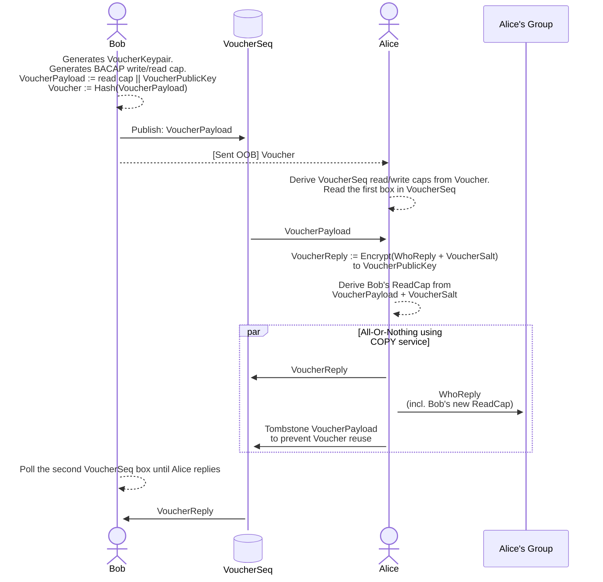

{ "title": "", "linkTitle": "Contact Voucher Design", "description": "",
"url": "docs/specs/voucher.html", "date":
"2026-05-01T15:15:43.499681-07:00", "draft": "false", "slug": "",
"layout": "", "type": "", "weight": "5" }

# Contact Voucher Design

### Threebit Hacker

### Leif Ryge

**Abstract**

------------------------------------------------------------------------

**Table of Contents**

[Voucher Design](#d58e28)

[Self-authenticating BACAP
payload](#d58e62)

## Voucher Design

In order to join or initiate a conversation, participants need to
exchange cryptographic key material. To address this problem we have a
slightly unusual design: Contact vouchers.

In many systems, invites to conversations flow from an existing member
of the conversation to the user being invited. In our "Contact Voucher"
protocol this flow is reversed: A member wishing to join a conversation
hands a "Contact Voucher" (out of band) to the existing member, who then
inducts the new member into the group.

This design mitigates two potential problem with the former way of doing
it:

1.  If the Contact Voucher is observed by a third-party, the third-party
    does not get to read neither participants' actual messages.

    

    - **Passive** adversaries learn that the
      voucher was spent, but do not get to observe further interactions.

    - **Active** adversaries can create a
      new fake group to induct the member into but does not learn
      anything about the existing group.

      

      - In the future to prevent this one-way impersonation we could
        allow a "both parties bring something on paper to the meeting":

        

        - Bob brings Contact Voucher

        - Alice brings fingerprint for the VoucherReplyPublicKey
          (thwarts the active attacker)

        

      

    

2.  Only one thing needs to delivered out of band to achieve a 2-pass
    protocol (instead of a 3-pass protocol).

- Only one of the parties need to bring key material to a meeting in
  order to establish contact.

### Self-authenticating BACAP payload

The first message sent (The VoucherPayload) is authenticated in the
following manner:

- The VoucherPayload is computed (first).

- A cryptographic hash of the VoucherPayload is computed. This hash
  **is** the
  *Voucher*\*.

- The **Voucher** is then used to derive a
  BACAP read/write capability set.

- The VoucherPayload is uploaded to the sequence described by the
  capability (at index 0).

- Anyone who intercepts the **Voucher** can
  read **and** write the sequence.

- But: Since the **Voucher** is a hash over
  the VoucherPayload, writing the sequence with anything but the
  VoucherPayload will be detectable by the recipient.

- This means that the contents *cannot* be
  undetectably be modified by the interceptor.

