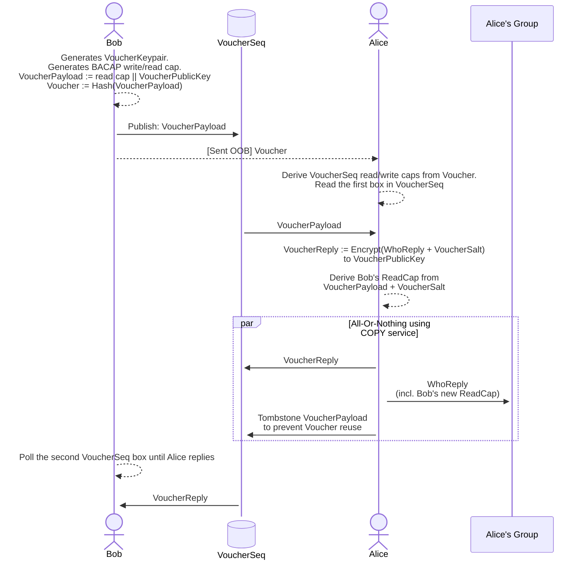

## 

### Threebit Hacker

### Leif Ryge

------------------------------------------------------------------------

In order to join or initiate a conversation, participants need to exchange cryptographic
key
material. To address this problem, we created a slightly unusual design: *contact
vouchers*.

In many systems, invites to conversations flow from an existing member of the conversation
to the user being invited. In our contact voucher protocol, this flow is reversed:
Bob, who
wishes to join a conversation, hands a contact voucher (out-of-band) to existing member
Alice,
who then inducts Bob into the group.

This design mitigates two potential problems with the conventional way of doing things:

1.  A third party who observes the contact voucher does not get to read either participant's
    actual messages. However,

    

    - A **passive** adversary learns that the voucher was
      spent, but does not get to observe further interactions.

    - An **active** adversary can create a new fake group
      to induct the member into, but does not learn anything about the existing group.

    

    In the future, to prevent this one-way impersonation, we could require that Alice
    and
    Bob both bring something on paper to their meeting.

    

    - Bob brings the contact voucher.

    - Alice brings a fingerprint for the `VoucherReplyPublicKey` (thwarting the
      active attacker).

    

2.  Only one thing that needs to delivered out-of-band to achieve a two-pass protocol
    (instead of a three-pass protocol):

    

    - One of the parties needs to bring key material to a meeting in order to establish
      contact.

    

The following diagram illustrates the contact voucher authentication handshake.

### Self-authenticating BACAP payload

The first message sent, the `VoucherPayload`, is authenticated in the following
manner:

- The `VoucherPayload` is computed (first).

- A cryptographic hash of the `VoucherPayload` is computed. This hash
  **is** the `Voucher`.

- The `Voucher` is then used to derive a BACAP read/write capability set.

- The `VoucherPayload` is uploaded to the sequence described by the
  capability (at index 0).

- Anyone who intercepts the `Voucher` can read from **and** write to the message sequence.

- But: Since the `Voucher` is a hash over the `VoucherPayload`,
  writing the sequence with anything but the `VoucherPayload` will be detectable
  by the recipient.

- This means that the contents *cannot* be undetectably modified by
  the interceptor.

