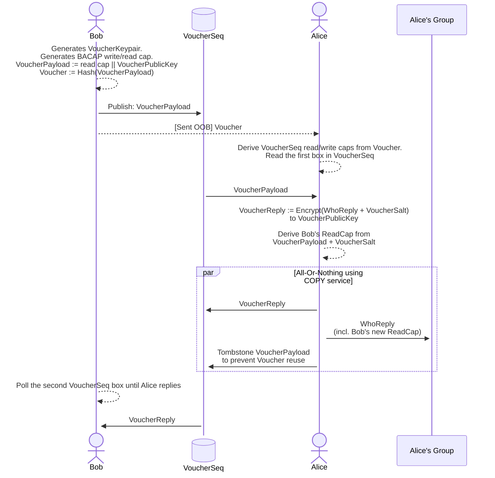

---
title:
linkTitle: "Group Chat"
url: "docs/specs/group_chat.html"
description: ""
categories: [""]
tags: [""]
author: ["Threebit Hacker", "David Stainton"]
version: 0
draft: false
---

# Katzenpost Group Chat Design

# Prerequisites

This design specification is dependent on the BACAP system, Blinded and Capability system
which is detailed in Section 4 of our paper: https://arxiv.org/abs/2501.02933

The source code to BACAP is found here: https://github.com/katzenpost/hpqc/blob/main/bacap/bacap.go
The API docs for BACAP is found here: https://pkg.go.dev/github.com/katzenpost/hpqc@v0.0.55/bacap


# Introduction

This is a minimum design we need to make a working group chat
protocol, without key rotation.

BACAP primitives give us:

* SingleMessage
* AllOrNothingMessage (for big messages: upload n chunks to temp
  stream and then put a pointer to that in your own stream as a single
  message)

The group chat is completely decentralized. Each member must keep track of
every other member:

Group State:
    * "MembershipCaps": For each member:
        * BACAP read caps
        * nick name
    * MembershipHash (hash of "MembershipCaps")


# Group Chat Message Types

All messages are SingleMessage if they fit in one BACAP slot, or an AllOrNothingMessage if they are too big.

* TEXT Payloads are normal chat text messages.

```golang

// TextPayload encapsulates a normal text message.
type TextPayload struct {
    // Payload contains a normal UTF-8 text message to be displayed inline.
    Payload []byte
}
```

* INTRODUCTION messages introduce new group members

```golang

// Introduction introduces a new member to the group.
type Introduction struct {
    // DisplayName is the party's name to be displayed in chat clients.
    DisplayName string
    
    // UniversalReadCap is the BACAP UniversalReadCap
    // which lets you read all messages posted by this user.
    UniversalReadCap *bacap.UniversalReadCap
}
```

* File Upload

A file upload can be used for different purposes such as uploading an image to
be displayed inline by the chat client. Likewise, a sound bite will be made visible in the chat
and there will be a "play" buttom to pay the audio. Beyond that, we can support
arbitrary file attachments.

```golang

// FileUpload encapsulates several file types
// which result in different client behaviors.
type FileUpload struct {
    // Payload contains the file payload.
    Payload []byte
    
    // FileType is the identifier for each file type.
    // Valid file types are:
    // "image"
    // "sound"
    // "arbitrary"
    FileType string
}
```

* WHO

The WHO message type is used to query who is currently in the group.

```golang

// Who is used to query the group chat to find out the member read capabilities.
type Who struct {}
```

* REPLYWHO

The REPLYWHO message answers the WHO query with an AllOrNothingMessage
BACAP stream containing read caps for all group chat members.

```golang


type ReplyWho struct {
    Payload *bacap.BacapStream
}
```

* Group chat message type

This message encapsulates all of the above message types
and is serialized with CBOR:

```golang

// GroupChatMessage encapsulates all chat message types.
type GroupChatMessage struct {
    // Version is used to ensure we can change this message type in the future.
    Version int

    // MembershipHash is the hash of the user's PleaseAdd message.
    MembershipHash *[32]byte
    
    TextPayload *TextPayload
    Introduction *Introduction
    FileUpload *FileUpload
    Who *Who
    ReplyWho *ReplyWho
}
```

# Protocol Flow

Protocol flow for making a new group from scratch (OOB / REUNION /
whatever) is essentially everybody exchanges `PleaseAdd` messages:

```golang

// PleaseAdd is a message used by a client to try and gain access to a chat group.
type PleaseAdd struct {
    // DisplayName is the party's name to be displayed in chat clients.
    DisplayName string
    
    // UniversalReadCap is the BACAP UniversalReadCap
    // which lets you read all messages posted by this user.
    UniversalReadCap *bacap.UniversalReadCap
}

type SignedPleaseAdd struct {
    // PleaseAdd contains the CBOR serialized PleaseAdd struct.
    PleaseAdd []byte
    
    // Signature contains the cryptographic signature over the PleaseAdd field.
    Signature []byte
}
```

Protocol flow for introduction to existing group over an existing
channel between introducer member and new member:

```golang

type Invitation struct {
    GroupName string
}
```

1. INVITATION: There exists a group called YoloGroup, do you wanna join?
A member of the group invites a new member with the `Invitation` message.

2. If the invited party wants to join then they reply with a `SignedPleaseAdd` message
which essentially says "I want to join your group" and it provides that new member's
BACAP Universal Read Capability, their display name and a cryptographic signature
produced by their BACAP write capability.

3. The introducer receives the `SignedPleaseAdd` message
   3.1 If the introducer does not like the DisplayName, they reply to the invited party with a `PleaseReviseDisplayName` message that contains the original SignedPleaseAdd. Then they wait for a new `SignedPleaseAdd`.

4. If they like the Display Name, they:
    4.a) existing members need the new member's read cap: introducer publishes the `SignedPleaseAdd` to their own BACAP stream for the rest of the group to read.
    4.b) the new member needs existing members read caps: reply to the new member: ReplyWho, containing read caps for all existing members.
    4.c) IMPORTANT: 4.a) and 4.b) MUST be sent in the same AllOrNothingMessage, despite 4.a) going to the introducer's own BACAP stream for the group and 4.b) being writes to the BACAP stream the introducer is using to communicate with the new member.

    4.2 NOTE: We COULD send this as part of the initial INVITATION, but then we get these silent members that can read stuff that nobody knows about, which is an anti-goal.

- Good question: What if we are adding a whole bunch of people at once; do we really need to upload all the members n times?


FUTURE WORK:
    - Forward secrecy: Can add two extensions that allow transmitting public keys + stuff encrypted under those public keys
    - We also refer to the Reunion protocol which is a n-way PAKE with strong anonymity properties. The reunion design is discussed in this PhD thesis:

    https://research.tue.nl/en/publications/communication-in-a-world-of-pervasive-surveillance-sources-and-me


    Currently there is a python reference implementation which can be found here: https://codeberg.org/rendezvous/reunion/


    However the core cryptography of the Reunion protocol was ported to golang, here: https://github.com/katzenpost/reunion/


# New Proposal Voucher Design

This is a new design proposed by Leif and Threebithacker:


## Contact vouchers

In order to join or initiate a conversation, participants need to exchange cryptographic key material.
To address this problem we have a slightly unusual design: Contact vouchers.

In many systems, invites to conversations flow from an existing member of the conversation to the user being invited.
In our "Contact Voucher" protocol this flow is reversed:
A member wishing to join a conversation hands a "Contact Voucher" (out of band) to the existing member, who then inducts the new member into the group.

This design mitigates two potential problem with the former way of doing it:
1. If the Contact Voucher is observed by a third-party, the third-party does not get to read neither participants' actual messages.
   - **Passive** adversaries learn that the voucher was spent, but do not get to observe further interactions.
   - **Active** adversaries can create a new fake group to induct the member into but does not learn anything about the existing group.
     - In the future to prevent this one-way impersonation we could allow a "both parties bring something on paper to the meeting":
       - Bob brings Contact Voucher
       - Alice brings fingerprint for the VoucherReplyPublicKey (thwarts the active attacker)
2. Only one thing needs to delivered out of band to achieve a 2-pass protocol (instead of a 3-pass protocol).
  - Only one of the parties need to bring key material to a meeting in order to establish contact.



## Self-authenticating BACAP payload
The first message sent (The VoucherPayload) is authenticated in the following manner:
- The VoucherPayload is computed (first).
- A cryptographic hash of the VoucherPayload is computed. This hash **is** the *Voucher**.
- The **Voucher** is then used to derive a BACAP read/write capability set.
- The VoucherPayload is uploaded to the sequence described by the capability (at index 0).
- Anyone who intercepts the **Voucher** can read **and** write the sequence.
- But: Since the **Voucher** is a hash over the VoucherPayload, writing the sequence with anything but the VoucherPayload will be detectable by the recipient.
- This means that the contents *cannot* be undetectably be modified by the interceptor.

