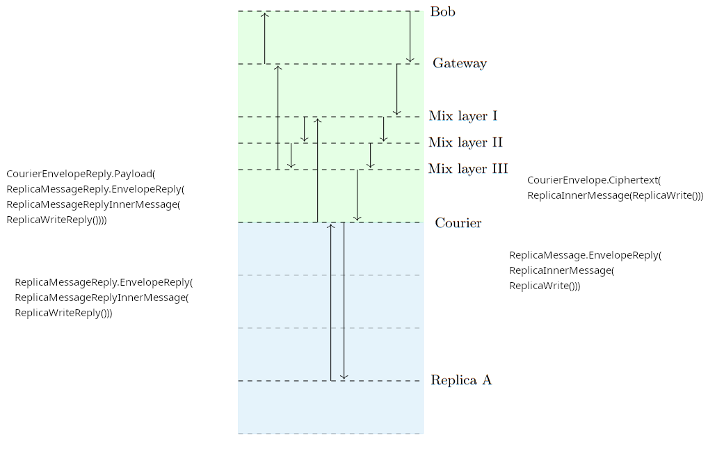
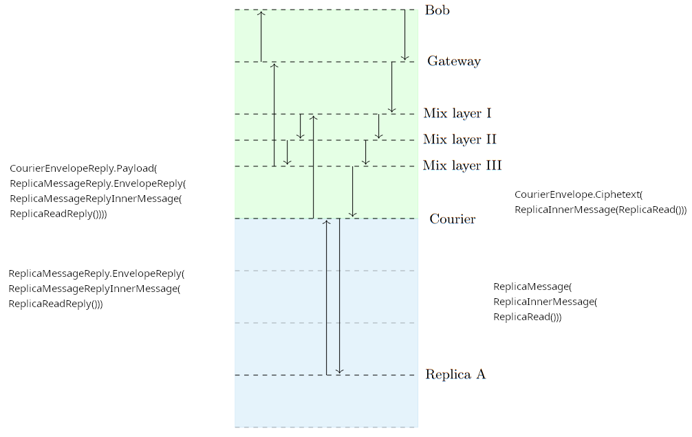

<div class="section">

<div class="titlepage">

<div>

<div>

## <span id="pigeonhole_protocol"></span>Pigeonhole protocol design

</div>

<div>

<div class="authorgroup">

<div class="author">

### <span class="firstname">Threebit</span> <span class="surname">Hacker</span>

</div>

<div class="author">

### <span class="firstname">David</span> <span class="surname">Stainton</span>

</div>

</div>

</div>

</div>

------------------------------------------------------------------------

</div>

<div class="section">

<div class="titlepage">

<div>

<div>

### <span id="d58e42"></span>Abstract

</div>

</div>

</div>

In this specification we describe the components and protocols that compose Pigeonhole
scattered storage. We define the behavior of communication clients that send and retrieve
individual messages, BACAP streams, and AllOrNothing streams. Client actions are mediated
through courier services that interact with storage replicas.

</div>

<div class="section">

<div class="titlepage">

<div>

<div>

### <span id="d58e45"></span>Introduction

</div>

</div>

</div>

Pigeonhole scattered storage enables persistent anonymous communication in which
participants experience a coherent sequence of messages or a continuous data stream,
but where
user relationships and relations between data blocks are unlinkable not only from
the
perspective of third-party observers, but also from that of the mixnet components.
This latter
attribute provides resilience against deanonymization by compromised mixnet nodes.

The data blocks that Pigeonhole stores are supplied by the BACAP
(Blinding-and-Capability) scheme. The Pigeonhole protocol scatters messages around
many
storage servers and among a space of BACAP box IDs. From a passive network observer's
perspective, all of this is seemingly random. All communication among users consists
of
user-generated read or write queries to Pigeonhole storage, never directly to other
users.

Many derivative protocols can be composed using Pigeonhole communication channels,
including group communications. For details about the protocol specified here, see
section
"§5.6. End-to-end reliable group channels" in our paper <a href="https://arxiv.org/abs/2501.02933" class="link" target="_top">Echomix: a Strong Anonymity System with
Messaging</a>. For more information about BACAP, see §4 of the paper. For an
understanding of how the core BACAP primitives are implemented, see <a href="https://github.com/katzenpost/hpqc/blob/main/bacap/bacap.go" class="link" target="_top">bacap.go</a>.

Message-layout snippets in this specification are given in the trunnel binary-format
description language (matching `pigeonhole/pigeonhole_messages.trunnel`);
code snippets showing in-memory courier or replica state are given in Go.

</div>

<div class="section">

<div class="titlepage">

<div>

<div>

### <span id="glossary"></span>Glossary

</div>

</div>

</div>

<div class="itemizedlist">

- <span class="strong">**Box**</span>: BACAP's unit of data storage. Each box has a
  box ID (which also serves as its public key), a signature, and a ciphertext signed
  payload.

- <span class="strong">**Courier**</span>: Service that runs on a service node and
  interacts with storage replicas. Proxies requests from clients and routes replies
  back to
  clients (via SURBs).

- <span class="strong">**Storage replica**</span>: The actual storage nodes where
  message ciphertexts are stored and retrieved.

- <span class="strong">**Intermediate replica**</span>: "Intermediate replicas are
  chosen independently of the two final replicas for that box ID which are derived using
  the
  sharding scheme. The reason Alice designates intermediate replicas, as opposed to
  addressing the final replicas directly, is to avoid revealing to the courier which
  shard
  the box falls into." (From "§5.4.1. Writing messages" in the <a href="https://arxiv.org/abs/2501.02933" class="link" target="_top">paper</a>.)<span class="strong">**Designated replica**</span> (a.k.a. <span class="emphasis">*final replica*</span>,
  <span class="emphasis">*shard replica*</span>): One of the two replicas selected deterministically
  for a given box ID by the `Shard2` consistent-hash algorithm. The intermediate
  replicas replicate writes through to the designated replicas.

- <span class="strong">**EnvelopeHash**</span>:
  `BLAKE2b-256(CourierEnvelope.sender_pubkey || CourierEnvelope.ciphertext)`. Used by the courier for deduplication of
  retransmissions and for demultiplexing replica replies.

- <span class="strong">**MKEM**</span>: Multi-recipient KEM addressed to the pair of
  intermediate replicas. One MKEM ciphertext carries, for each recipient, a separate
  DEK
  encapsulation (`Dek1`, `Dek2`); either recipient may
  decapsulate and recover the padded `ReplicaInnerMessage`.

- <span class="strong">**Replica-epoch**</span>: A one-week period, distinct from the
  20-minute mixnet PKI epoch, during which a given replica-side MKEM envelope keypair
  is
  valid. See <a href="#epochs" class="xref" title="Epochs">the section called “Epochs”</a> below.

</div>

</div>

<div class="section">

<div class="titlepage">

<div>

<div>

### <span id="storage_deployment"></span>Storage deployment requirements

</div>

</div>

</div>

A conforming deployment MUST run at least <span class="strong">**four**</span>
storage replicas (n ≥ 4). The enables the intermediate-replica unlinkability property
described in the <a href="#glossary" class="xref" title="Glossary">the section called “Glossary”</a> and in §5.4.1 of the paper: for each
`CourierEnvelope`, the client picks two <span class="emphasis">*intermediate*</span>
replicas which MUST be disjoint from the two <span class="emphasis">*final*</span> (sharded) replicas
that hold the box. Disjointness is what prevents the courier from learning which shard
the box
falls into.

A conformant deployment and its undesirable alternatives can be compared as
follows.

<div class="itemizedlist">

- <span class="strong">**n ≥ 4**</span>: At least two non-shard replicas exist, so
  the intermediate set can be drawn uniformly at random from the non-shard subset, and
  disjointness is preserved.

- <span class="strong">**n = 3**</span>: Only one replica sits outside any given
  two-shard set, so the client cannot pick two independent non-shard intermediates.
  Implementations in this case fall back to an intermediate set that includes at least
  one
  shard replica, which tells the courier that replica is one of the two shards for the
  box.

  The resulting information exposure is bounded:

  <div class="itemizedlist">

  - The courier does NOT learn the box ID. The box ID lives inside the
    MKEM-encrypted inner message addressed to the intermediate replicas; only the
    replicas can decrypt it.

  - The courier does NOT learn the other shard member. Knowing one element of the
    two-element shard set does not constrain the identity of the other among the
    remaining replicas.

  - The courier does NOT gain a way to link boxes in the same sequence. BACAP's
    unlinkability of consecutive box IDs (paper §4) is a property of the
    capability-derivation scheme and is independent of sharding.

  </div>

- <span class="strong">**n = 2**</span>: There is only one possible shard set, and
  the intermediate set is necessarily identical to it.

</div>

Consequently, the main unlinkability properties of Pigeonhole are not lost at <span class="emphasis">*n
= 3*</span>, but the defense-in-depth margin provided by disjoint intermediate replicas
is. Operators SHOULD treat <span class="emphasis">*n ≥ 4*</span> as the minimum supported configuration.

</div>

<div class="section">

<div class="titlepage">

<div>

<div>

### <span id="epochs"></span>Epochs

</div>

</div>

</div>

Katzenpost has two distinct notions of "epoch" that operate on very different
timescales, and Pigeonhole touches both:

<div class="itemizedlist">

- <span class="strong">**Mixnet epoch**</span> (a.k.a. <span class="emphasis">*normal
  epoch*</span>, <span class="emphasis">*PKI epoch*</span>): the short cadence on which the
  directory authorities publish a new PKI document. The default is 20 minutes. Mix nodes,
  gateways, service nodes, and clients all synchronise on this epoch. Sphinx replay
  keys on
  mix nodes rotate once per mixnet epoch.

- <span class="strong">**Pigeonhole storage-replica epoch**</span>: the long cadence
  on which each storage replica rotates its MKEM envelope keypair. The default is one
  week.
  A replica publishes, in every mixnet-epoch PKI descriptor, <span class="emphasis">*two*</span>
  envelope public keys: the current replica-epoch key and the next replica-epoch key.

</div>

<div class="section">

<div class="titlepage">

<div>

<div>

#### <span id="d58e191"></span>Epoch tolerance for CourierEnvelope

</div>

</div>

</div>

A `CourierEnvelope` carries an `epoch` field that identifies the
replica epoch whose envelope key the client used to encrypt the MKEM ciphertext. Conforming
couriers and storage replicas MUST accept `epoch ∈ {current − 1, current, current + 1}` where `current` is the courier's / replica's own view of the current
replica epoch.

The `current − 1` tolerance handles the grace window immediately after
a replica-epoch boundary, when a client with a slightly stale PKI view still encrypts
to the
previous envelope public key. Combined with `current`, this gives a
<span class="strong">**two replica-epoch data TTL**</span> — roughly two weeks —
because the future replica-epoch key is by definition a key that hasn't started being
used
yet, so `current` and `current − 1` are the epochs where
actual data flows.

The `current + 1` tolerance handles the same boundary seen from the
other side: a client whose clock or PKI view is slightly <span class="emphasis">*ahead*</span> of the
courier / replica.

Envelopes outside this three-epoch window MUST be rejected, because by definition
no
replica still holds the matching decapsulation key:

<div class="itemizedlist">

- Older than `current − 1`: the envelope public key has been pruned
  from replicas (see the replica's envelope-key GC worker). The replica cannot decrypt
  and
  the courier can fail fast rather than forward a doomed request.

- Newer than `current + 1`: no replica has generated that envelope
  key yet (replicas generate `current` and `current + 1`
  only).

</div>

Couriers SHOULD reject with a dedicated envelope-level error code
(`EnvelopeErrorInvalidEpoch`) so clients can distinguish "stale
encryption" from other courier-side rejections.

</div>

</div>

<div class="section">

<div class="titlepage">

<div>

<div>

### <span id="d58e242"></span>Pigeonhole message format and constants

</div>

</div>

</div>

The Pigeonhole message types are defined in trunnel at <a href="https://github.com/katzenpost/katzenpost/blob/main/pigeonhole/pigeonhole_messages.trunnel" class="link" target="_top"><code class="code">pigeonhole/pigeonhole_messages.trunnel</code></a>; the Go bindings live in <a href="https://github.com/katzenpost/katzenpost/blob/main/pigeonhole/trunnel_messages.go" class="link" target="_top"><code class="code">pigeonhole/trunnel_messages.go</code></a>. All integer fields are big-endian and
all variable-length fields carry an explicit length prefix. This trunnel encoding
replaces the
earlier CBOR encoding with a fixed-overhead binary format whose serialised size can
be
computed deterministically from the Sphinx geometry.

Carriage of these messages differs by hop:

<div class="itemizedlist">

- <span class="strong">**Client → Courier:**</span> a `CourierQuery` is
  carried inside a Sphinx packet payload. (See <a href="#courier_query" class="xref" title="CourierQuery">the section called “CourierQuery”</a> for details.)
  The reverse direction uses a SURB supplied by the client.

- <span class="strong">**Courier → Replica and Replica → Replica:**</span> the
  courier and replicas do not use Sphinx packets between themselves. They communicate
  over
  the Katzenpost wire protocol defined in `core/wire` and
  `core/wire/commands`; the relevant commands are `ReplicaMessage`,
  `ReplicaMessageReply`, `ReplicaWrite`, and
  `ReplicaWriteReply`. Some of these commands embed trunnel-serialised
  pigeonhole blobs as their payload.

</div>

<div class="section">

<div class="titlepage">

<div>

<div>

#### <span id="d58e281"></span>Fundamental size constants

</div>

</div>

</div>

<div class="table">

<span id="d58e283"></span>

**Table 1. **

<div class="table-contents">

<table class="table" data-border="1">
<thead>
<tr class="header">
<th>Constant</th>
<th>Value</th>
<th>Source</th>
</tr>
</thead>
<tbody>
<tr class="odd">
<td><code class="code">BACAP_BOX_ID_SIZE</code></td>
<td>32 bytes</td>
<td>Ed25519 public key</td>
</tr>
<tr class="even">
<td><code class="code">BACAP_SIGNATURE_SIZE</code></td>
<td>64 bytes</td>
<td>Ed25519 signature</td>
</tr>
<tr class="odd">
<td><code class="code">HASH_SIZE</code></td>
<td>32 bytes</td>
<td>BLAKE2b-256</td>
</tr>
<tr class="even">
<td><code class="code">MKEM_DEK_SIZE</code></td>
<td>60 bytes</td>
<td>mkem.DEKSize</td>
</tr>
<tr class="odd">
<td>CTIDH-1024 public key</td>
<td>160 bytes</td>
<td>hpqc/nike/ctidh/ctidh1024</td>
</tr>
<tr class="even">
<td>X25519 public key</td>
<td>32 bytes</td>
<td><code class="code">hpqc/nike/x25519</code></td>
</tr>
<tr class="odd">
<td>Hybrid CTIDH-1024 × X25519 NIKE public key</td>
<td>192 bytes</td>
<td>sum of the above</td>
</tr>
<tr class="even">
<td>BACAP payload encryption overhead</td>
<td>16 bytes</td>
<td>ChaCha20-Poly1305 AEAD</td>
</tr>
<tr class="odd">
<td>MKEM encapsulation overhead</td>
<td>28 bytes</td>
<td>ChaCha20-Poly1305 nonce (12) + tag (16)</td>
</tr>
</tbody>
</table>

</div>

</div>

  

</div>

<div class="section">

<div class="titlepage">

<div>

<div>

#### <span id="d58e337"></span>Maximum BACAP payload

</div>

</div>

</div>

The maximum plaintext BACAP payload a single box can carry is derived
<span class="emphasis">*backwards*</span> from the Sphinx `UserForwardPayloadLength` by
subtracting every layer of framing and cryptographic overhead that sits between the
Sphinx
payload and the BACAP plaintext. The authoritative calculation is performed by
`NewGeometryFromSphinx` in <a href="https://github.com/katzenpost/katzenpost/blob/main/pigeonhole/geo/geometry.go" class="link" target="_top"><code class="code">pigeonhole/geo/geometry.go</code></a>.

Informally:

``` programlisting
MaxPlaintextPayloadLength
  = UserForwardPayloadLength
    − CourierQuery framing (1 byte: query_type discriminator)
    − CourierEnvelope header (intermediate_replicas[2] + Dek1 + Dek2
                              + reply_index + epoch + sender_pubkey_len
                              + sender_pubkey + ciphertext_len)
    − MKEM AEAD overhead (28 bytes)
    − ReplicaInnerMessage framing (1 byte: message_type discriminator)
    − ReplicaWrite header (box_id + signature + payload_len = 100 bytes)
    − BACAP AEAD overhead (16 bytes)
    − BACAP length prefix (4 bytes)  
```

With a hybrid CTIDH-1024 × X25519 NIKE, the fixed per-packet overhead between
`UserForwardPayloadLength` and the BACAP plaintext is on the order of 560
bytes; the exact figure depends on the configured NIKE scheme and should always be
obtained
from `geometry.NewGeometryFromSphinx()` rather than computed by hand.

</div>

<div class="section">

<div class="titlepage">

<div>

<div>

#### <span id="courier_envelope"></span>The CourierEnvelope as seen by the courier

</div>

</div>

</div>

The courier, upon unwrapping the Sphinx payload of a client's packet, sees a
`CourierQuery` whose `content` is a `CourierEnvelope`
with the following layout:

``` go 
struct courier_envelope {
    u8  intermediate_replicas[2];          // replica indices in the PKI
    u8  dek1[MKEM_DEK_SIZE];               // DEK encapsulation for replica 0
    u8  dek2[MKEM_DEK_SIZE];               // DEK encapsulation for replica 1
    u8  reply_index;                       // which replica's reply to prefer
    u64 epoch;                             // replica-epoch under which the
                                           //   MKEM ciphertext was produced
    u16 sender_pubkey_len;
    u8  sender_pubkey[sender_pubkey_len];  // client's ephemeral hybrid NIKE pk
    u32 ciphertext_len;
    u8  ciphertext[ciphertext_len];        // MKEM-encrypted ReplicaInnerMessage
} 
```

Notable points:

<div class="itemizedlist">

- The `ciphertext` is opaque to the courier. It is an MKEM envelope
  addressed to the <span class="emphasis">*pair*</span> of intermediate replicas; either replica can
  decapsulate using its own DEK (`dek1` or `dek2` respectively).

- The `epoch` field names the <span class="emphasis">*replica-epoch*</span> whose
  envelope keys were used to produce the MKEM ciphertext. See <a href="#epochs" class="xref" title="Epochs">the section called “Epochs”</a> for
  the tolerance window.

- Prior to encryption, the inner `ReplicaInnerMessage` is zero-padded to
  `ReplicaInnerMessageWriteSize()` so that reads, writes and tombstones
  produce MKEM ciphertexts of identical length.

</div>

</div>

<div class="section">

<div class="titlepage">

<div>

<div>

#### <span id="d58e399"></span>The ReplicaInnerMessage as seen by a replica

</div>

</div>

</div>

Once an intermediate replica decrypts the MKEM envelope, it obtains a
`ReplicaInnerMessage` — a discriminated union over `message_type`:

``` go
struct replica_inner_message {
    u8 message_type IN [0, 1];    // 0 = read, 1 = write
    union content[message_type] {
        0: struct replica_read  read_msg;   // { box_id[32] }
        1: struct replica_write write_msg;  // { box_id[32], signature[64],
                                            //   payload_len[u32], payload[] }
    };
} 
```

A `ReplicaWrite` with `payload_len == 0` is a <a href="#tombstones" class="link" title="Tombstones">tombstone</a>.

</div>

</div>

<div class="section">

<div class="titlepage">

<div>

<div>

### <span id="d58e417"></span>Message types and interactions

</div>

</div>

</div>

<div class="section">

<div class="titlepage">

<div>

<div>

#### <span id="d58e419"></span>Overview

</div>

</div>

</div>

<div class="itemizedlist">

- A client sends a `CourierQuery` inside a Sphinx packet payload. The
  courier's reply travels back to the client by means of a SURB the client also supplied.

- A client always designates <span class="strong">**two**</span> intermediate
  replicas per `CourierEnvelope`. The courier dispatches the corresponding pair
  of `ReplicaMessage` wire commands, one to each intermediate, and collects up
  to two `ReplicaMessageReply` results.

- The `reply_index` field is a <span class="emphasis">*preference*</span> indicating
  which of the two replica replies the client would like forwarded first. It is not
  a
  strict selector: should the preferred slot still be empty when the courier is ready
  to
  respond, the courier falls back to whichever reply it does hold, and indicates in
  the
  `CourierEnvelopeReply` the actual index that was served (see <a href="https://github.com/katzenpost/katzenpost/blob/main/courier/server/plugin.go" class="link" target="_top"><code class="code">courier/server/plugin.go</code></a>).

- Clients MUST resend identical `CourierEnvelope` bodies — same
  `sender_pubkey` and `ciphertext` — until they receive a reply.
  The courier deduplicates resends by `EnvelopeHash`. Only the Sphinx-layer
  SURB is rotated between retransmissions.

</div>

</div>

<div class="section">

<div class="titlepage">

<div>

<div>

#### <span id="courier_query"></span>CourierQuery

</div>

</div>

</div>

A `CourierQuery` is the top-level discriminated union that a client places
into a Sphinx packet payload for the courier:

``` go
struct courier_query {
    u8 query_type IN [0, 1];
    union content[query_type] {
        0: struct courier_envelope envelope;      // read or write a single box
        1: struct copy_command     copy_command;  // AllOrNothing copy
    };
}  
```

The symmetric reply is a `CourierQueryReply`:

``` go
struct courier_query_reply {
    u8 reply_type IN [0, 1];
    union content[reply_type] {
        0: struct courier_envelope_reply envelope_reply;
        1: struct copy_command_reply     copy_command_reply;
    };
}  
```

</div>

<div class="section">

<div class="titlepage">

<div>

<div>

#### <span id="d58e475"></span>CourierEnvelope

</div>

</div>

</div>

The `CourierEnvelope` layout was given in <a href="#courier_envelope" class="xref" title="The CourierEnvelope as seen by the courier">the section called “The CourierEnvelope as seen by the courier”</a>.
The client constructs one `CourierEnvelope` per read or write. The courier
performs the following actions.

<div class="orderedlist">

1.  Computes `EnvelopeHash = BLAKE2b-256(sender_pubkey || ciphertext)`.

2.  Verifies `epoch ∈ {current − 1, current, current + 1}` per the
    replica-epoch tolerance window, otherwise rejecting with
    `EnvelopeErrorInvalidEpoch`.

3.  Looks `EnvelopeHash` up in its dedup cache. If present, the courier
    returns the cached reply (or an `ACK` if no reply has yet arrived) without
    re-dispatching to replicas.

4.  On a cache miss, the courier constructs two `ReplicaMessage` wire
    commands — one bound for `intermediate_replicas[0]` carrying
    `dek1`, the other for `intermediate_replicas[1]` carrying
    `dek2` — and forwards them over the wire protocol.

5.  The courier immediately sends an `ACK` reply to the client so it may stop
    retransmitting.

</div>

</div>

<div class="section">

<div class="titlepage">

<div>

<div>

#### <span id="d58e523"></span>ReplicaMessage (wire command)

</div>

</div>

</div>

`ReplicaMessage` is <span class="emphasis">*not*</span> a trunnel pigeonhole type; it is
the `core/wire/commands` command sent from a courier to a replica. Its payload
fields are copied verbatim from the matching `CourierEnvelope`:

``` go
// core/wire/commands
type ReplicaMessage struct {
    SenderEPubKey []byte     // copied from CourierEnvelope.sender_pubkey
    DEK           *[MKEM_DEK_SIZE]byte  // dek1 or dek2, depending on destination
    Ciphertext    []byte     // copied from CourierEnvelope.ciphertext
}
```

The recipient replica decapsulates the MKEM envelope using the replica-epoch key that
corresponds to `CourierEnvelope.epoch` (trying each of the three keys in its
tolerance window), yielding a padded `ReplicaInnerMessage`. The replica then
dispatches on `message_type` to `ReplicaRead` or
`ReplicaWrite` handling.

</div>

<div class="section">

<div class="titlepage">

<div>

<div>

#### <span id="d58e548"></span>ReplicaMessageReply (wire command)

</div>

</div>

</div>

In response to a `ReplicaMessage`, the courier expects an asynchronous
`ReplicaMessageReply` wire command from the replica:

``` go
// core/wire/commands
type ReplicaMessageReply struct {
    ErrorCode     uint8                 // see the replica error-code table below
    EnvelopeHash  *[HASH_SIZE]byte      // lets the courier demultiplex the reply
    EnvelopeReply []byte                // MKEM-encrypted ReplicaMessageReplyInnerMessage
}
```

The `EnvelopeReply` byte blob is produced by the replica via the MKEM
scheme's `EnvelopeReply()` method (see <a href="https://github.com/katzenpost/katzenpost/blob/main/replica/handlers.go" class="link" target="_top"><code class="code">replica/handlers.go</code></a>). It carries a
`ReplicaMessageReplyInnerMessage` — a discriminated union over either a
`ReplicaReadReply` or a `ReplicaWriteReply` — padded to
`ReplicaReplyInnerMessageReadSize()` so that read replies and write replies are
indistinguishable in size, and encrypted to the client's ephemeral NIKE public key
under the
replica's envelope keypair.

</div>

<div class="section">

<div class="titlepage">

<div>

<div>

#### <span id="d58e576"></span>CourierBookKeeping

</div>

</div>

</div>

For each outstanding `EnvelopeHash`, the courier maintains an in-memory dedup
entry. Its actual structure is:

``` go
// courier/server/plugin.go
type CourierBookKeeping struct {
    Epoch                uint64        // replica-epoch at cache insertion
    CreatedAt            time.Time     // for TTL eviction (~5 minutes)
    QueryType            uint8         // the query_type that produced this entry
    IntermediateReplicas [2]uint8
    EnvelopeReplies      [2]*commands.ReplicaMessageReply
}  
```

Note that the courier does <span class="strong">**not**</span> cache SURBs or SURB
timestamps. A client's SURB is consumed by the Sphinx-layer plugin infrastructure
at the
moment the courier emits a reply and is not retained by the courier's Pigeonhole state.
Should the client not receive that reply, it is expected to retransmit a fresh Sphinx
packet
carrying a fresh SURB but the identical `CourierEnvelope` body; the courier,
recognising the `EnvelopeHash`, replies using the new SURB.

The dedup cache has a TTL of 5 minutes (`DedupCacheTTL` in <a href="https://github.com/katzenpost/katzenpost/blob/main/courier/server/plugin.go" class="link" target="_top"><code class="code">courier/server/plugin.go</code></a>).

</div>

<div class="section">

<div class="titlepage">

<div>

<div>

#### <span id="d58e600"></span>CourierEnvelopeReply

</div>

</div>

</div>

The courier's reply to a `CourierEnvelope` has the following trunnel layout:

``` go
struct courier_envelope_reply {
    u8  envelope_hash[HASH_SIZE];       // identifies the originating envelope
    u8  reply_index;                    // which intermediate replica's reply
                                        //   is being returned (may differ
                                        //   from the client's requested index)
    u8  reply_type IN [0, 1];           // 0 = ACK, 1 = PAYLOAD
    u32 payload_len;
    u8  payload[payload_len];           // the MKEM-encrypted EnvelopeReply,
                                        //   present iff reply_type == PAYLOAD
    u8  error_code;                     // see envelope error codes below
}
```

A `reply_type` of `ACK` (0) indicates the courier has received the
envelope and dispatched it to the replicas but has not yet received a reply for the
requested index. A `reply_type` of `PAYLOAD` (1) indicates the
`payload` field carries the MKEM-encrypted `EnvelopeReply` produced
by a replica.

</div>

</div>

<div class="section">

<div class="titlepage">

<div>

<div>

### <span id="d58e622"></span>Embedded pigeonhole types

</div>

</div>

</div>

These trunnel structs are not carried on the wire in isolation; they are embedded
inside
MKEM envelopes and their replies.

<div class="section">

<div class="titlepage">

<div>

<div>

#### <span id="d58e625"></span>ReplicaRead

</div>

</div>

</div>

Embedded inside the MKEM-encrypted `ReplicaInnerMessage` a client sends to a
replica (via the courier) for a read operation.

``` go
struct replica_read {
    u8 box_id[BACAP_BOX_ID_SIZE];
}  
```

</div>

<div class="section">

<div class="titlepage">

<div>

<div>

#### <span id="d58e632"></span>ReplicaReadReply

</div>

</div>

</div>

Embedded inside the MKEM-encrypted `ReplicaMessageReplyInnerMessage` a
replica returns for a successful read. Padding is applied at the outer
`ReplicaMessageReplyInnerMessage` level; this struct carries no padding of its
own.

``` go
struct replica_read_reply {
    u8  error_code;
    u8  box_id[BACAP_BOX_ID_SIZE];
    u8  signature[BACAP_SIGNATURE_SIZE];
    u32 payload_len;
    u8  payload[payload_len];
}
```

</div>

<div class="section">

<div class="titlepage">

<div>

<div>

#### <span id="d58e641"></span>ReplicaWrite

</div>

</div>

</div>

Used both (a) embedded inside the MKEM-encrypted `ReplicaInnerMessage` for a
client write, and (b) carried directly as a `core/wire/commands` command between
replicas during replication.

``` go
struct replica_write {
    u8  box_id[BACAP_BOX_ID_SIZE];
    u8  signature[BACAP_SIGNATURE_SIZE];
    u32 payload_len;
    u8  payload[payload_len];
}
```

A `ReplicaWrite` with `payload_len == 0` is a <span class="strong">**tombstone**</span>. Replicas treat tombstone writes as overwrites: an
existing box at the same `box_id` is replaced by the tombstone, and subsequent
reads return `ReplicaErrorTombstone`.

</div>

<div class="section">

<div class="titlepage">

<div>

<div>

#### <span id="d58e663"></span>ReplicaWriteReply

</div>

</div>
</div>

Embedded inside a
`ReplicaMessageReplyInnerMessage` on the client
reply path, and also used as the
`core/wire/commands` reply to inter-replica
replication.

``` go
struct replica_write_reply {
    u8 error_code;
}
```

</div>

</div>

<div class="section">

<div class="titlepage">

<div>

<div>

### <span id="tombstones"></span>Tombstones

</div>

</div>

</div>

A `ReplicaWrite` whose `payload_len == 0` is a
<span class="emphasis">*tombstone*</span>. It marks a box as deleted without revealing that fact to the
courier.

<div class="itemizedlist">

- Replicas treat a tombstone write as an ordinary overwrite. An existing
  `Box` at the same `box_id` is replaced by the tombstone, and
  subsequent reads of that `box_id` return `ReplicaErrorTombstone`.
  (See <a href="#replica_error_codes" class="xref" title="Replica error codes">the section called “Replica error codes”</a>.)

- `ReplicaErrorTombstone` is an <span class="italic">expected</span>
  outcome rather than a failure; it positively confirms that the box was deleted, as
  distinct from `ReplicaErrorBoxNotFound`.

- Because the inner `ReplicaInnerMessage` is zero-padded to
  `ReplicaInnerMessageWriteSize()` before MKEM encryption (as described in
  <a href="#courier_envelope" class="xref" title="The CourierEnvelope as seen by the courier">the section called “The CourierEnvelope as seen by the courier”</a>), a tombstone write produces an MKEM ciphertext of
  exactly the same length as a non-empty write or a read. A passive observer therefore
  cannot distinguish deletion from any other operation.

</div>

Tombstones are also used by the <a href="#allornothing" class="link" title="Pigeonhole AllOrNothing protocol">AllOrNothing copy
protocol</a>. After processing a `CopyCommand`, the courier overwrites every
box of the temporary stream with tombstones.

</div>

<div class="section">

<div class="titlepage">

<div>

<div>

### <span id="d58e722"></span>EnvelopeHash

</div>

</div>

</div>

The `EnvelopeHash` uniquely identifies a
`CourierEnvelope` for the purposes of deduplication
and reply demultiplexing. It is computed as:

``` go
EnvelopeHash = BLAKE2b-256(sender_pubkey || ciphertext)
```

where `sender_pubkey` and `ciphertext` are the corresponding fields
of the `CourierEnvelope`. The implementation is `CourierEnvelope.EnvelopeHash()` in <a href="https://github.com/katzenpost/katzenpost/blob/main/pigeonhole/helpers.go" class="link" target="_top"><code class="code">pigeonhole/helpers.go</code></a>.

A retransmitted `CourierEnvelope` carries the same `sender_pubkey`
and `ciphertext` as the original, and therefore hashes to the same value; only the
surrounding Sphinx packet (and its SURB) changes between attempts.

</div>

<div class="section">

<div class="titlepage">

<div>

<div>

### <span id="d58e753"></span>Error codes

</div>

</div>

</div>

All error codes are defined in <a href="https://github.com/katzenpost/katzenpost/blob/main/pigeonhole/errors.go" class="link" target="_top"><code class="code">pigeonhole/errors.go</code></a>.

<div class="section">

<div class="titlepage">

<div>

<div>

#### <span id="replica_error_codes"></span>Replica error codes

</div>

</div>

</div>

Returned by a replica in `ReplicaMessageReply.ErrorCode`,
`ReplicaReadReply.error_code`, and `ReplicaWriteReply.error_code`.

<div class="table">

<span id="d58e771"></span>

**Table 2. **

<div class="table-contents">

<table class="table" data-summary="" data-border="1">
<thead>
<tr class="header">
<th>Code</th>
<th>Name</th>
<th>Meaning</th>
</tr>
</thead>
<tbody>
<tr class="odd">
<td>0</td>
<td><code class="code">ReplicaSuccess</code></td>
<td>Operation completed successfully</td>
</tr>
<tr class="even">
<td>1</td>
<td><code class="code">ReplicaErrorBoxIDNotFound</code></td>
<td>Read miss (expected outcome)</td>
</tr>
<tr class="odd">
<td>2</td>
<td><code class="code">ReplicaErrorInvalidBoxID</code></td>
<td>Malformed box ID</td>
</tr>
<tr class="even">
<td>3</td>
<td><code class="code">ReplicaErrorInvalidSignature</code></td>
<td>BACAP signature verification failed</td>
</tr>
<tr class="odd">
<td>4</td>
<td><code class="code">ReplicaErrorDatabaseFailure</code></td>
<td>Transient RocksDB error</td>
</tr>
<tr class="even">
<td>5</td>
<td><code class="code">ReplicaErrorInvalidPayload</code></td>
<td>Malformed payload</td>
</tr>
<tr class="odd">
<td>6</td>
<td><code class="code">ReplicaErrorStorageFull</code></td>
<td>Storage capacity exceeded</td>
</tr>
<tr class="even">
<td>7</td>
<td><code class="code">ReplicaErrorInternalError</code></td>
<td>Internal server error</td>
</tr>
<tr class="odd">
<td>8</td>
<td><code class="code">ReplicaErrorInvalidEpoch</code></td>
<td>Replica-epoch envelope key unavailable</td>
</tr>
<tr class="even">
<td>9</td>
<td><code class="code">ReplicaErrorReplicationFailed</code></td>
<td>Replication to shard peer failed</td>
</tr>
<tr class="odd">
<td>10</td>
<td><code class="code">ReplicaErrorBoxAlreadyExists</code></td>
<td>Idempotent-write outcome (expected)</td>
</tr>
<tr class="even">
<td>11</td>
<td><code class="code">ReplicaErrorTombstone</code></td>
<td>Read returned a tombstone (expected)</td>
</tr>
</tbody>
</table>

</div>

</div>

  

Codes 1, 10 and 11 are "expected outcomes" — they correspond to normal
protocol states rather than faults. The thin-client helper
`thin.IsExpectedOutcome(err)` treats these three codes as non-errors.

</div>

<div class="section">

<div class="titlepage">

<div>

<div>

#### <span id="d58e848"></span>Courier envelope error codes

</div>

</div>

</div>

Returned by the courier in `CourierEnvelopeReply.error_code`.

<div class="table">

<span id="d58e854"></span>

**Table 3. **

<div class="table-contents">

<table class="table" data-summary="" data-border="1">
<thead>
<tr class="header">
<th>Code</th>
<th>Name</th>
<th>Meaning</th>
</tr>
</thead>
<tbody>
<tr class="odd">
<td>0</td>
<td><code class="code">EnvelopeErrorSuccess</code></td>
<td>Operation completed.</td>
</tr>
<tr class="even">
<td>1</td>
<td><code class="code">EnvelopeErrorInvalidEnvelope</code></td>
<td>Malformed envelope (e.g. <code class="code">reply_index &gt; 1</code>)</td>
</tr>
<tr class="odd">
<td>2</td>
<td><code class="code">EnvelopeErrorCacheCorruption</code></td>
<td>Internal cache inconsistency</td>
</tr>
<tr class="even">
<td>3</td>
<td><code class="code">EnvelopeErrorPropagationError</code></td>
<td>Failed to dispatch to replicas.</td>
</tr>
<tr class="odd">
<td>4</td>
<td><code class="code">EnvelopeErrorInvalidEpoch</code></td>
<td><code class="code">CourierEnvelope.epoch</code> outside tolerance window.</td>
</tr>
</tbody>
</table>

</div>

</div>

  

</div>

<div class="section">

<div class="titlepage">

<div>

<div>

#### <span id="d58e896"></span>Copy command status codes

</div>

</div>

</div>

Returned by the courier in `CopyCommandReply.status` (see below).

Returned by the courier in the `status` field of a
`CopyCommandReply`. (See <a href="#copycommandreply" class="xref" title="CopyCommandReply">the section called “CopyCommandReply”</a> for more
information.)

<div class="table">

<span id="d58e910"></span>

**Table 4. **

<div class="table-contents">

<table class="table" data-border="1">
<thead>
<tr class="header">
<th>Code</th>
<th>Name</th>
<th>Meaning</th>
</tr>
</thead>
<tbody>
<tr class="odd">
<td>0</td>
<td><code class="code">CopyStatusSucceeded</code></td>
<td>All destination writes completed.</td>
</tr>
<tr class="even">
<td>1</td>
<td><code class="code">CopyStatusInProgress</code></td>
<td>Courier has accepted the command; processing continues.</td>
</tr>
<tr class="odd">
<td>2</td>
<td><code class="code">CopyStatusFailed</code></td>
<td>Aborted; see <code class="code">error_code</code> +
<code class="code">failed_envelope_index</code>.</td>
</tr>
</tbody>
</table>

</div>

</div>

  

</div>

</div>

<div class="section">

<div class="titlepage">

<div>

<div>

### <span id="d58e943"></span>Sharding and replica selection

</div>

</div>

</div>

For each box, two <span class="emphasis">*designated*</span> (final) replicas are derived
deterministically from the box ID using the `Shard2` consistent-hash algorithm.
(See <a href="https://github.com/katzenpost/katzenpost/blob/main/replica/common/shard.go" class="link" target="_top"><code class="code">replica/common/shard.go</code></a>.):

``` go
for each online replica r with identity key k_r:
    h_r = BLAKE2b-256(k_r || box_id)
return the two replicas whose h_r are smallest
```

The two <span class="emphasis">*intermediate*</span> replicas chosen by the client for a given
`CourierEnvelope` are drawn independently of the designated replicas, per
`pigeonhole.GetRandomIntermediateReplicas`:

<div class="itemizedlist">

- <span class="strong">**n ≥ 4 replicas:**</span> two intermediates are drawn
  uniformly at random from the replicas that are <span class="strong">**not**</span> in
  the designated (shard) set — preserving the disjointness invariant described in <a href="#storage_deployment" class="xref" title="Storage deployment requirements">the section called “Storage deployment requirements”</a>.

- <span class="strong">**n = 3:**</span> fallback — at least one intermediate must
  coincide with a designated replica; this weakens the intermediate/final disjointness
  guarantee but does not compromise box unlinkability.

- <span class="strong">**n \< 3:**</span> rejected.

</div>

Intermediate replicas, upon accepting a `ReplicaWrite`, compute the designated
replicas themselves and forward the `ReplicaWrite` to them via the
`core/wire/commands``ReplicaWrite` command (see <a href="https://github.com/katzenpost/katzenpost/blob/main/replica/connector.go" class="link" target="_top"><code class="code">replica/connector.go</code></a>).

</div>

<div class="section">

<div class="titlepage">

<div>

<div>

### <span id="d58e998"></span>Protocol sequence visualizations

</div>

</div>

</div>

For simplicity, the following diagrams omit replication while illustrating the Pigeonhole
write and read operations.

<span class="strong">**Pigeonhole write operation**</span>

<div class="figure">

<span id="d58e1005"></span>

**Figure 1. Annotated writes**

<div class="figure-contents">

<div class="mediaobject">



</div>

</div>

</div>

  

<span class="strong">**Pigeonhole read operation**</span>

<div class="figure">

<span id="d58e1018"></span>

**Figure 2. Annotated reads**

<div class="figure-contents">

<div class="mediaobject">



</div>

</div>

</div>

  

</div>

<div class="section">

<div class="titlepage">

<div>

<div>

### <span id="allornothing"></span>Pigeonhole AllOrNothing protocol

</div>

</div>

</div>

The AllOrNothing delivery mechanism ensures that a set of associated BACAP writes
either
succeeds or fails atomically from the point of view of a replica or second-party client
reader. This behavior prevents an adversary from detecting a correlation between (A)
the
sending client's failure to transmit multiple messages at once with (B) a network
interruption
on the sending client's side of the network. Regardless of the number of messages
in the set,
the adversary gets to observe "at most once" that the sending client interacted with
the network.

The protocol works as follows.

<div class="section">

<div class="titlepage">

<div>

<div>

#### <span id="d58e1032"></span>Step 1

</div>

</div>

</div>

The client uploads a <span class="emphasis">*temporary Pigeonhole stream*</span>.

The stream conveys a sequence of `CourierEnvelope`s. Each
`CourierEnvelope` is serialised and prefixed with a single 4-byte
(`u32`) length field giving the size of that one envelope; the resulting
length-prefixed blobs are concatenated back-to-back into one continuous byte stream.

That byte stream is then split across the BACAP Boxes of the temporary stream. A
serialised `CourierEnvelope` is strictly larger than the maximum BACAP box
payload (it wraps a full box payload plus its own metadata), so a single envelope
does not
fit in one box and the concatenated stream necessarily spans several boxes. Envelope
boundaries therefore do not align with box boundaries. The precise framing is given
in <a href="#temp_stream" class="xref" title="Temporary stream data format">the section called “Temporary stream data format”</a>.

</div>

<div class="section">

<div class="titlepage">

<div>

<div>

#### <span id="d58e1052"></span>Step 2

</div>

</div>

</div>

The client sends a random courier the copy command which encapsulates the write
capability to the temporary Pigeonhole stream written in Step 1 above. When the courier
receives this copy command it extracts the `ReadCap` from the given
`WriteCap` and uses it to read the stream of data. The courier then reads a box
at a time and tries to extract 0 or 1 envelopes from each accumulation of stream segments.

After processing the command, the courier then overwrites the temporary stream with
tombstones.

</div>

<div class="section">

<div class="titlepage">

<div>

<div>

#### <span id="temp_stream"></span>Temporary stream data format

</div>

</div>

</div>

Each box in the temporary stream is a serialized `CopyStreamElement`.
Defined in trunnel as:

``` go
// CopyStreamElement - wraps a CourierEnvelope chunk with stream position flags.
// Overhead: 1 byte (flags) + 4 bytes (envelope_len) = 5 bytes
struct copy_stream_element {
    // Flags: bit 0 = isStart, bit 1 = isFinal
    u8 flags;
  
    // The CourierEnvelope serialized bytes
    u32 envelope_len;
    u8 envelope_data[envelope_len];
}
```

Here it is in golang:

``` go
type CopyStreamElement struct {
    Flags        uint8
    EnvelopeLen  uint32
    EnvelopeData []uint8
}
```

The purpose of this specific format is to use the `isStart` and
`isFinal` flags to tell the courier the first box and last box of the stream to
process. The payloads encapsulated within the `EnvelopeData` fields of many of
these `CopyStreamElement`s is itself a stream of data which contains
`CourierEnvelope`s with four-byte prefixes.

A key property of this encoding is that envelope boundaries do not align with box
boundaries. Each BACAP box payload has a maximum size of N bytes, but a serialized
`CourierEnvelope` (which contains a full box payload plus metadata) exceeds N
bytes. Therefore envelopes are serialized into a continuous byte stream and split
across
multiple boxes in the temporary copy stream:

``` programlisting
TEMPORARY COPY STREAM BOXES (each holds N bytes):
┌─────────────┐ ┌─────────────┐ ┌─────────────┐ ┌─────────────┐ ┌─────────────┐
│    Box 0    │ │    Box 1    │ │    Box 2    │ │    Box 3    │ │    Box 4    │
└─────────────┘ └─────────────┘ └─────────────┘ └─────────────┘ └─────────────┘
SERIALIZED ENVELOPE DATA (envelope boundaries don't align with box boundaries):
┌─────────────────────────┐┌────────────────────┐┌──────────────────────────┐
│       Envelope 1        ││     Envelope 2     ││       Envelope 3         │
└─────────────────────────┘└────────────────────┘└──────────────────────────┘
|         |         |         |         |         |
     Box 0     Box 1     Box 2     Box 3     Box 4
```

The courier reads the stream box by box, accumulating data until it can extract complete
envelopes. The `isStart` and `isFinal` flags on the
`CopyStreamElement` wrappers tell the courier where the stream begins and ends.

Each embedded `CourierEnvelope` is processed as a normal write and results in
a `ReplicaMessage` being dispatched to the intermediate replicas over the wire
protocol.

The courier does NOT need to keep track of the `EnvelopeHash` for each
contained `CourierEnvelope` for the purpose of replying to the client (the
"client" of these envelopes being, in this case, the courier itself), but it does
need to keep resending them until the intermediate replicas have ACKed them.

The courier MUST keep track of the hash of the `CopyCommand` (computed as
`BLAKE2b-256(write_cap)`) and MUST NOT process a given command more than once.
This dedup cache has a TTL of 30 minutes (`CopyDedupCacheTTL` in <a href="https://github.com/katzenpost/katzenpost/blob/main/courier/server/plugin.go" class="link" target="_top"><code class="code">courier/server/plugin.go</code></a>).

</div>

<div class="section">

<div class="titlepage">

<div>

<div>

#### <span id="d58e1120"></span>CopyCommand

</div>

</div>

</div>

`CopyCommand` is sent by a client to its chosen courier after the client has
successfully uploaded every box of the temporary stream. The trunnel layout is:

``` go
struct copy_command {
    u32 write_cap_len;
    u8  write_cap[write_cap_len];   // serialised BACAP BoxOwnerCap
}
```

On receipt, the courier:

<div class="orderedlist">

1.  Computes `copyKey = BLAKE2b-256(write_cap)`.

2.  Consults its copy dedup cache. If an in-progress entry is found, the courier
    responds immediately with `CopyStatusInProgress`. If a completed entry within
    its TTL is found, the courier returns the cached terminal reply.

3.  Otherwise, the courier reconstructs the BACAP `WriteCap` from the bytes,
    derives the corresponding `ReadCap`, and reads the temporary stream box by
    box, feeding the decrypted BACAP payloads into a `CopyStreamEnvelopeDecoder`.

4.  Each complete `CourierEnvelope` emitted by the decoder is dispatched to
    its two intermediate replicas; the courier waits for acknowledgements with bounded
    retries and exponential backoff.

5.  Upon processing the box bearing the `isFinal` flag (or upon an
    unrecoverable failure), the courier attempts — on a best-effort basis — to overwrite
    every box of the temporary stream with a tombstone.

</div>

Replica error handling during a `CopyCommand` is classified as <span class="strong">**temporary**</span> or <span class="strong">**permanent**</span> by
<a href="https://github.com/katzenpost/katzenpost/blob/main/courier/server/copy_errors.go" class="link" target="_top"><code class="code">courier/server/copy_errors.go</code></a>: transient errors (storage full,
database failure, internal error, replication failed, box-ID not found) trigger bounded
retries against the same shard before failover; permanent errors (invalid box ID,
invalid
signature, invalid payload, invalid epoch, box already exists, tombstone) cause immediate
failover or abort.

</div>

<div class="section">

<div class="titlepage">

<div>

<div>

#### <span id="copycommandreply"></span>CopyCommandReply

</div>

</div>

</div>

The courier's reply to a `CopyCommand` has the following trunnel layout:

``` go
struct copy_command_reply {
    u8  status;                   // CopyStatus{Succeeded, InProgress, Failed}
    u8  error_code;               // replica error code (meaningful iff status == Failed)
    u64 failed_envelope_index;    // 1-based sequential position in the
                                  //   CourierEnvelope stream at which processing
                                  //   stopped (meaningful iff status == Failed)
}  
```

The status codes are enumerated in "Copy command status codes" above.
`failed_envelope_index` counts <span class="emphasis">*envelopes*</span> within the
stream, not boxes: the first envelope in the first box of the temporary stream is
index 1.

A client receiving `CopyStatusInProgress` should continue polling — i.e.
resend the same `CopyCommand` via a fresh SURB after a short interval
(`CopyPollInterval`, currently 5 seconds) — until it receives either
`CopyStatusSucceeded` or `CopyStatusFailed`. Because the courier's
copy dedup cache keys on `BLAKE2b-256(write_cap)`, these repeated polls will not
cause the `CopyCommand` to be processed more than once.

</div>

<div class="section">

<div class="titlepage">

<div>

<div>

#### <span id="d58e1201"></span>Potential use cases of AllOrNothing

</div>

</div>

</div>

In no particular order:

<div class="itemizedlist">

- Atomically writing to two or more boxes.

  <div class="itemizedlist">

  - The boxes can reside on distinct streams (or not); the courier doesn't know
    anything about streams of `CourierEnvelope`.

  </div>

- Sending long messages that span more than one BACAP payload, like a file / document
  / picture.

- Group chat join uses AllOrNothing when adding a new member to the group:

  <div class="itemizedlist">

  - The person introducing a new member writes to their group chat stream.

  - The person introducing a new member also writes to the existing conversation
    stream that the new member can already read.

  </div>

- Group chat uses AllOrNothing in all cases where it needs to send long messages --
  files, pictures, audio, long cryptographic keys such as the group membership list,
  and
  so on.

</div>

</div>

</div>

<div class="section">

<div class="titlepage">

<div>

<div>

### <span id="d58e1224"></span>Protocol narration example

</div>

</div>

</div>

<span class="bold">**Alice wants to send a message to Bob, who is already connected to
Alice. That is, Alice will write to a box with ID 12345 that Bob is trying to read
from.**</span>

<div class="orderedlist">

1.  Alice sends:

    <div class="orderedlist">

    1.  SPHINX packet containing:

        <div class="itemizedlist">

        - SPHINX header

          <div class="itemizedlist">

          - Routing commands to make it arrive at a courier (on a service provider)

          </div>

        - SPHINX payload

          <div class="itemizedlist">

          - Reply SURB

          - `CourierEnvelope` encrypted for a courier chosen at random. The
            envelope tells the courier about two randomly chosen replicas ("intermediate replicas").

          </div>

        </div>

    2.  Alice doesn't know if the packet makes it through the network. Until she
        receives a reply, she keeps resending the `CourierEnvelope` to the same courier.

    </div>

2.  The courier receives the `CourierEnvelope` from Alice.

    <div class="orderedlist">

    1.  The courier records the `EnvelopeHash` of
        the `CourierEnvelope` in its
        `CourierBookKeeping` datastructure.

    2.  If the courier has already seen that hash, GOTO step 4.

    </div>

3.  The courier sends an ACK to Alice using the SURB on file for Alice, telling her to
    stop resending the `CourierEnvelope`. If there's no SURB, the Courier waits for
    the next re-sent `CourierEnvelope` from Alice matching the
    `EnvelopeHash`.

    <div class="orderedlist">

    1.  The courier constructs two `ReplicaMessage` objects and puts them in
        its outgoing queue for the two intermediate replicas. (Note that each courier
        maintains constant-rate traffic with all replicas).

    2.  The courier keeps doing this for each intermediate replica until it receives an
        ACK from that replica.

    </div>

</div>

<span class="bold">**Alice’s actions are now complete.**</span>

<div class="orderedlist">

4.  The two intermediate replicas receive the two
    `ReplicaMessage` objects.

    <div class="orderedlist">

    1.  They decrypt them and compute the "designated
        replicas" based on the BACAP box ID.

    2.  The replicas put ACKs in their outgoing queues for the courier saying "we have
        received these messages" (see step 3.2), referencing the `EnvelopeHash`.
        This tells the courier to stop resending to the intermediate replicas.

    3.  They put the decrypted contents (a
        `ReplicaWrite` BACAP tuple: box ID 12345;
        signature; encrypted payload) in their outgoing queues for the
        "designated replicas".

    4.  Each replica waits for a reply from its designated replica.

    5.  When an intermediate replica receives its ACK from the designated replica,
        the intermediate replica has no more tasks.

    </div>

</div>

<span class="bold">**Bob now wants to check if Alice has written a message at box
12345.**</span>

<div class="orderedlist">

5.  Similar to step 1, Bob sends a SPHINX packet to a courier chosen at random.

    <div class="orderedlist">

    1.  SPHINX packet containing:

        <div class="itemizedlist">

        - SPHINX header

          <div class="itemizedlist">

          - Routing commands to make it arrive at a courier (on a
            service provider).

          </div>

        - SPHINX payload

          <div class="itemizedlist">

          - The envelope tells the courier about two randomly chosen replicas
            (“intermediate replicas”).

          - `CourierEnvelope` encrypted for a
            courier chosen at random. Its encrypted payload is a
            `ReplicaRead` command (reference box ID
            12345).

          </div>

        </div>

    2.  Bob doesn't know if the packet makes it through the network. Until he
        receives a reply, he keeps resending the `CourierEnvelope` to the same courier.

    </div>

6.  The courier receives Bob's `CourierEnvelope`. (Similar to step 2).

7.  The courier sends an ACK to Bob. (Similar to step 3.)

8.  The two intermediate replicas receive the two `ReplicaMessage` objects
    containing Bob's `ReplicaRead`.

    <div class="orderedlist">

    1.  Similar to 4.A.

    2.  Similar to 4.B.

    3.  Similar to 4.C.

    4.  Similar to 4.D.

    5.  When the intermediate replica receives its ACK from the designated replica, it
        will include the (perhaps confusingly named) `ReplicaWrite` (BACAP
        tuple).

    6.  The intermediate replica wraps it in a `ReplicaMessageReply` encrypted
        for Bob's `ReplicaMessage.EPubKey` and puts it in its outgoing queue for
        the Courier.

    </div>

9.  The Courier receives two `ReplicaMessageReply` wire commands from the two
    intermediate replicas.

    <div class="orderedlist">

    1.  It matches `ReplicaMessageReply.EnvelopeHash` to its recorded
        bookkeeping state (step 2.1).

    2.  It wraps the replica's `EnvelopeReply`
        blob (the MKEM-encrypted
        `ReplicaMessageReplyInnerMessage`) into a
        `CourierEnvelopeReply` with
        `reply_type = PAYLOAD`, and — if Bob's latest
        retransmission arrived with a fresh Sphinx SURB — forwards the
        resulting `CourierQueryReply` back through the
        mixnet to Bob.

    3.  Either way the courier retains the
        `ReplicaMessageReply` in its dedup cache for
        the cache TTL (5 minutes), so that a subsequently-arriving
        retransmission of the same envelope can be served from cache
        without re-dispatching to replicas.

    </div>

10. Bob keeps resending his `CourierEnvelope` from step 5 until he receives a
    `CourierEnvelopeReply` with `reply_type = PAYLOAD`.

    <div class="orderedlist">

    1.  Bob decapsulates the MKEM `EnvelopeReply` with the private key
        corresponding to the `sender_pubkey` he put in his
        `CourierEnvelope`, obtaining the padded
        `ReplicaMessageReplyInnerMessage`.

    2.  Once unpadded, the inner message is either a `ReplicaReadReply`
        carrying the BACAP tuple (box ID, signature, ciphertext) or a non-success
        `error_code`. If the code is `ReplicaErrorBoxIDNotFound`, Bob
        waits and polls again (i.e. returns to step 5). If it is
        `ReplicaErrorTombstone`, Alice has deleted the message. Otherwise Bob
        BACAP-decrypts and verifies the payload.

    </div>

</div>

<span class="bold">**Bob can now read Alice's message.**</span>

</div>

</div>
